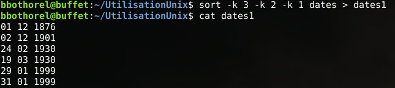
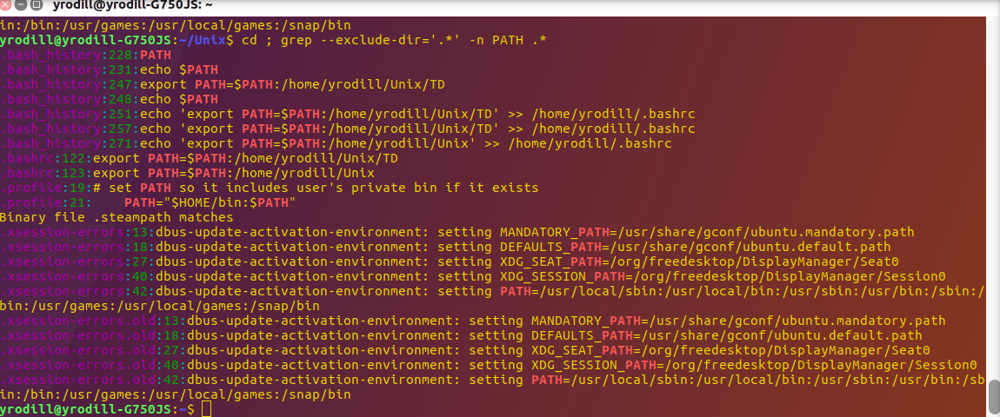
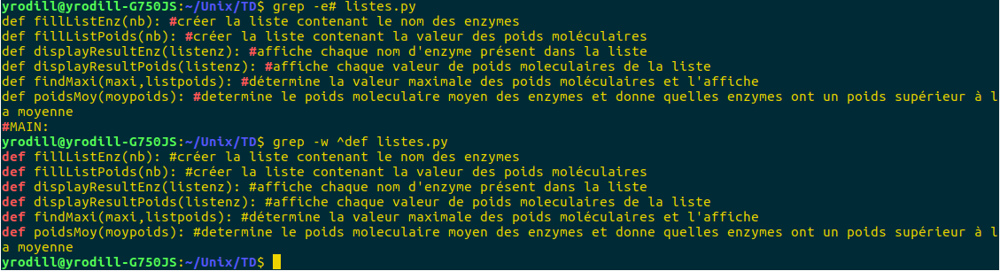
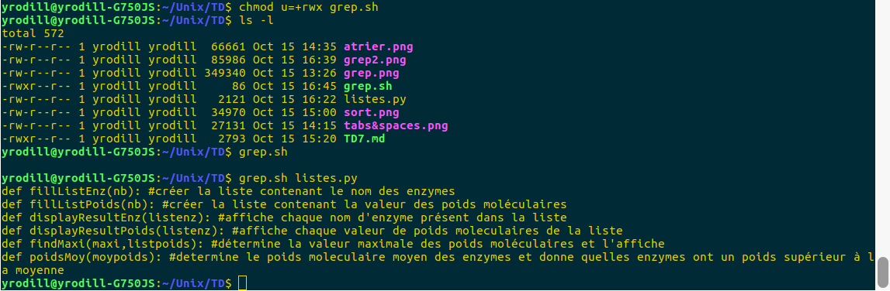
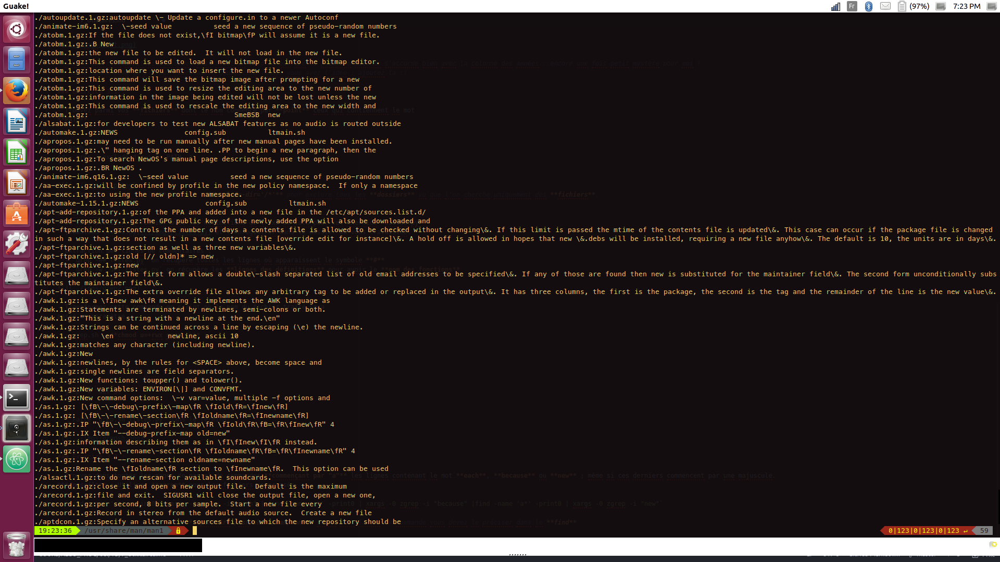
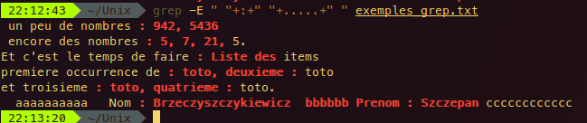

# **TD7 Utilisation des systèmes informatiques : "Utilitaires(1)"**

## 1) *Présentation du script-shell :*

- *__Petit rappel__* : utiliser la commande **chmod u=+rwx nomdufichier** pour administrer les droits du fichier

  ```bash
  #!/bin/bash
  # nomdufichier = monpremierscriptshell.sh
  # chmod u=+rwx monpremierscriptshell
  ps -f
  echo mon premier paramètre est $1.
  echo mon deuxième paramètre est $2.
  echo mon troisième paramètre est $3.
  ```
  >Vous pouvez ensuite entrer dans votre terminal : **monpremierscriptshell.sh** pour le lancer.  
  Si ça ***ne marche pas*** il faut que vous soyez dans le **bon répertoire** ou avoir ajouter le chemin vers votre fichier dans la variable **PATH**.

## 2) *Exercices :*

### Pour savoir comment utiliser les commandes, ayez le réflexe :
- **man commande** ou **commande --help**

### Exercice 2.2 :

- On remplace les **tabulations** par des **espaces**, on a donc beaucoup plus de caractères dans le fichier blancs_et_tabs1


### Exercice 2.3 :

- `cut -c 4-8 acouper` pour obtenir les colonnes **4 à 8**
- `cut -c 4- acouper` pour obtenir toutes les colonnes après **4**

### Exercice 2.4 :

- Il suffit de remplacer les **tabulations** par des **espaces** dans le fichier **acouper0**

### Exercice 2.6 :

- créer fichier : **renverser.sh** , puis faire **chmod u=r+w+x renverser.sh** avant de lancer le script
  - être placé dans le même dossier où se trouvent les fichiers utilisés par le script
  - cd ~/Unix/ (dans mon répertoire)

```bash
cp atrier1 atrier2 ; cat -n atrier2 > atrier3 ; sort -r -g atrier3 > atrier4 ; cut -f 2- atrier4 > atrierfinal
rm atrier2 atrier3 atrier4
cat atrier1
cat atrierfinal
```
> Je n'ai pas réussi à faire fonctionner avec les **pipes** en utilisant un seul fichier si quelqu'un a la soluce...vous pouvez l'intégrer au-dessus de ce commentaire ! Thanks


### Exercice 2.7 :

- Trier le fichier **dates** en fonction des années puis des mois et enfin des jours

```bash
sort -g dates > dates1
```



> Soit l'exercice était simplissime, soit c'est un coup de bol que la première colonne s'accorde bien avec la colonne des années...encore une fois petit mystère pour moi !  
Je pense quand même qu'il faut faire autre chose...si jamais vous avez l'idée ; ajoutez la :)

### Exercice 3.1 :

- Trouvez parmi vos **fichiers** dont le nom commence par **point** ceux qui contiennent le mot
**PATH**


```bash
cd ; grep --exclude-dir='.*' PATH .*
```


> **cd** pour revenir à la **racine** ; **exclude-dir='/*'** pour exclure tous les **dossiers** vu que l'on cherche uniquement des **fichiers**.

### Exercice 3.2 :
- Je vais utiliser le fichier avec les définitions de l'exo de Tata pour cet exercice "listes.py"
- [Download listes.py](../imgs/listes.py) et l'enregistrer dans le dossier où vous travaillez.

- Extraction des lignes de commentaires :
  - `grep -e# listes.py` on récupère toutes les lignes où apparaissent le symbole **#**
  - `grep -w ^def listes.py` on récupère les **lignes des définitions** pour avoir le **nom des fonctions**



- Transformez cette commande en script où le nom du fichier traité sera
passé en paramètre

  - grep.sh - **chmod u=+rwx grep.sh** :

  ```bash
  #!/bin/bash
  #script-shell name = grep.sh
  #entrez votre nom de fichier
  grep -w ^def $1
  ```

  - Faire `grep.sh listes.py` dans le terminal



### Exercice 3.3 :

- Trouver dans toutes les pages de manuel de commandes **commençant par "a"** les lignes contenant le mot **each**, **because** ou **new** ; même si ces derniers commencent par une majuscule.  
***Conseil*** : Utiliser **zgrep** pour les fichiers compressés

  - `find -name 'a*' -print0 | xargs -0 zgrep -i "each" | find -name 'a*' -print0 | xargs -0 zgrep -i "because" |find -name 'a*' -print0 | xargs -0 zgrep -i "new"`

> SI jamais vous n'êtes pas dans le **répertoire /usr/share/man/man1** quand vous lancez la commande vous devez le préciser dans le **find**.  
Donc je trouve que c'était compliqué...si jamais quelqu'un a plus simple ->   
le **-i** pour chercher en **majuscule et minuscule** ; **zgrep** pour les **fichiers compressés (.gz)** ; et répétition pour chaque **pipe** parce que ça marchait pas autrement pour moi...



### Exercice 3.4 :

- Ecrire une commande qui affiche **toutes les lignes** du fichier **exemples_grep.txt** qui contiennent le mot **ligne** suivi de **deux chiffres**
  - `grep -E ligne.\[0-9]\[0-9] exemples_grep.txt`

    

- Ecrire une commande qui affiche **toutes les lignes** qui contiennent le symbole **":"** en fin de ligne.
  - `grep -E :$ exemples_grep.txt`

    

- Ecrire une commande qui affiche **toutes les lignes** qui contiennent **un espace**, suivi du symbole **":"**, suivis d’**un espace**, suivi de **cinq caractères quelconques**, suivi à nouveau d’**un espace**.
  - `grep -E " "+:+" "+.....+" " exemples_grep.txt`

    
