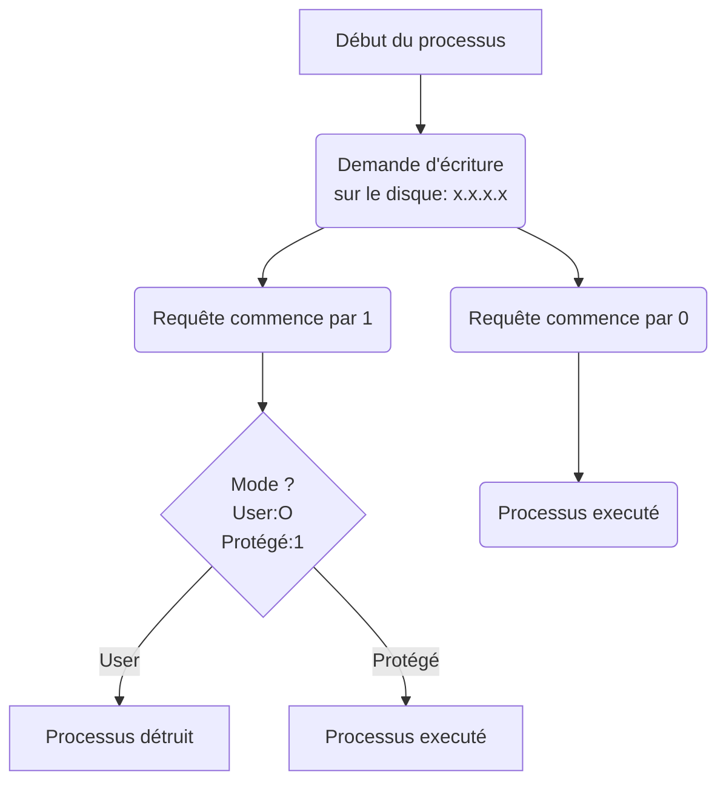

# Utilisation des Systèmes Informatiques


<!-- @import "[TOC]" {cmd="toc" depthFrom=1 depthTo=6 orderedList=false} -->
<!-- code_chunk_output -->

* [Utilisation des Systèmes Informatiques](#utilisation-des-systèmes-informatiques)
	* [I. Ordinateur](#i-ordinateur)
		* [A. Composants basiques:](#a-composants-basiques)
			* [Le contenu de la RAM:](#le-contenu-de-la-ram)
		* [B. Le processeur](#b-le-processeur)
	* [II. Les processus](#ii-les-processus)
		* [A. Jeux d'instructions du processeur](#a-jeux-dinstructions-du-processeur)
		* [B. Etats des Processus:](#b-etats-des-processus)
		* [C. Filiation des processus](#c-filiation-des-processus)
		* [D. Les librairies de langages](#d-les-librairies-de-langages)
	* [III. Environnements UNIX](#iii-environnements-unix)
		* [Propriétaire et groupe (unix)](#propriétaire-et-groupe-unix)
		* [Comment tuer un processus](#comment-tuer-un-processus)
		* [Système de Fichiers](#système-de-fichiers)
			* [Physique](#physique)
			* [Logique](#logique)
		* [Désignation des fichiers et répertoire](#désignation-des-fichiers-et-répertoire)
	* [IV. Protections et accès](#iv-protections-et-accès)
	* [V. SHELL](#v-shell)
		* [A. Variable exportées / Non exportées](#a-variable-exportées-non-exportées)
		* [B. Fenêtre "TERMINAL"](#b-fenêtre-terminal)
		* [C. Redirections](#c-redirections)
			* [1. Redirection ENTREE STANDARD (STDIN)](#1-redirection-entree-standard-stdin)
			* [2. Redirection SORTIE STANDARD (STDOUT)](#2-redirection-sortie-standard-stdout)
			* [3. Redirection SORTIE D'ERREUR STANDARD (STDERR)](#3-redirection-sortie-derreur-standard-stderr)
		* [D. Pipe](#d-pipe)
		* [E. Accéder au contenu d'une variable](#e-accéder-au-contenu-dune-variable)
		* [F. Code de retour d'un processus:](#f-code-de-retour-dun-processus)
		* [G. Enchaînement de pipe (= pipeline)](#g-enchaînement-de-pipe-pipeline)
		* [H. Enchaînement de processus](#h-enchaînement-de-processus)
* [Annexe](#annexe)
	* [Outils Libres et Non Libres sur PC](#outils-libres-et-non-libres-sur-pc)

<!-- /code_chunk_output -->


## I. Ordinateur

### A. Composants basiques:

- **Microprocesseur**

- **RAM**: Random Access Memory.
  - Accessible en lecture et écriture.
  - Encore appelé Mémoire vive.

- **Type de périphériques**:
  - D'entrée: clavier, scanner, HDD (Hard Drive Disk -> dique dur)...
  - De sortie: écran, imprimante, HDD...

- **Horloge**.


Le temps est "discret". Il n'est pas continue, mais s'execute à des temps défini. Une Horloge marque le "pas" du temps.

***Règle***:  A un instant donné, le processeur *(considéré comme monocore - avec une seule unité)* ne peut effectuer qu'une seule opération élémentaire: lire une case mémoire sur la RAM, écrire sur la RAM, executer une instruction élementaire...).

####Le contenu de la RAM:

L'information est stocké sous forme binaire. La taille de la case mémoire est généralement de 64 bits qui contiennent des data ou des instructions.


### B. Le processeur

Le processeur contient l'**UAL** : Unité Arithmétique et Logique.


*L'intérêt du schéma ici c'est juste A B et Y... A et B les deux chiffres et Y le résultat.*

A est appelé R1 par le prof, B est R2, Y est R3. L'UAL lit les cases A et B et affiche le résultat sur Y (instruction: save R3 sur la RAM).

Pour additionner deux réels, on a 6 "top horloges":

- lire R1
- lire R2
- calculer R3
- save R3
- afficher R3
- ?

Les **FLOPS** sont *les nombres d'opérations en virgule flottante par seconde.*

Il faut une puissance de calcul de 1 GFLOPS (lire gigaFLOPS) avec un processeur de 6GHz.

**Temps d'accès moyen à une case mémoire:**

- sur la RAM: quelques nano-secondes
- sur un SSD: quelques microsecondes
- sur un DD: quelques millisecondes


## II. Les processus

Un processus est une **"occurence"** en mémoire d'un programme éxecutable.

Le noyau du système gère le stockage mémoire de la RAM. Cela garantie l'intégrité de fonctionnement de l'ordinateur et protège le matériel présent qui a des ressource **critique**.

Le code du noyau se trouve sur le DD et il est chargé dans la RAM au **boot** de l'ordinateur.
Le processur attribue un identifiant unique à chaque processus, le **PID**. C'est un nombre entier (exemple: PID = 8112). Le noyau lui n'a **pas**  de PID.


*Exemple de représentation d'un processus:*

**Calculatrice**

​	| CODE

​	|

​	PID


L'horloge relié au microprocesseur envoie une décharge électrique au bout de $\Delta$t(s) qui va retirer/geler le processus en cours et charger le noyau. Ce $\Delta$t est appelé le **quantium** de temps. Ceci permet d'éviter qu'un processus utilise indéfiniment le processeur ne permettant pas aux autres processus de fonctionner.


Ou Schéma trouvé sur internet....


Si le noyau n'a pas finit de traiter les demandes des différents processus (appelés **"appels systèmes"**), il est quand même déchargé et rechargé ensuite par l'horloge. $\Delta$t est en général de l'ordre de quelques millisecondes donnant une impression de fluidité (cache les gelages des différents processus).

**CPU**: Controll Process Unit.

Un processus peut "s'auto-geler" s'il n'a plus rien à faire pendant $\Delta$t, il fait un *appel système*. Avant l'ordonnancement (le choix du prochain processus à éxecuter) le noyau execute les Appels Système.


### A. Jeux d'instructions du processeur

Les **instructions critiques** du processeur accèdent au matériel (par exemple: écriture sur le disque dur) et les **non critiques** ne peuvent pas y accéder. Pour protéger le matériel de demandes illégitimes de processus (malveillants notemment), ils ont rajoutés dans le processeur une case mémoire de 1 bit (0 ou 1) appelé le **mode**.

En effet seul le noyau doit executer les appels systèmes et peut demander aux processeur d'écrire sur le disque par exemple. Si on ne met pas en classe cette sécurité supplémentaire, des programmes pourrait copier un bout du code du noyau et executer des appels systèmes à la place de ce dernier.

Quand la case mémoire est sur 0: ***mode user***

Quand la case mémoire est sur 1: ***mode protégé***

Exemple (les nombres et les instructions sont arbitraires)



En fait, si l'instruction est critique (ici commence par **1**), il faut absolument que le mode du processeur corresponde et soit sur 1 aussi sinon le processus est détruit. Dans tous les autres cas le processus est executé. Dans le graph avec les processus plus haut, c'est au moment où l'horloge envoie ces courants électriques que le basculement du mode se fait. Lorsque ce sont les processus courrants qui sont sur le processeur le mode est **0**, lorsque le noyau passe sur le processeur, l'horloge bascule le mode sur **1**. Ainsi seul le noyau peut executer les instructions critiques (incluant les appels systèmes).

***Comment le processeur sait où trouver le code du noyau dans la RAM puisque le noyau n'a pas de PID ?***

Le noyau n'a pas de PID mais étant chargé en premier lors du démarrage de l'ordinateur il se trouve "tout en bas" de la RAM au début. Donc le processeur a chaque fois qu'il doit aller chercher le noyau dans la RAM il va "chercher" dans l'adresse électronique la plus basse (imaginer la RAM comme un immeuble, le noyau est au rez de chaussée).

Pour que le noyau soit chargé en premier lors du démarage de l'ordinateur il y a un composant à coté du processeur qui contient un peu de mémoire la **ROM** qui contient le **BIOS**, un petit utitilitaire qui permet de choisir le système d'exploitation ( et le noyau ) en cherchant dans le disque dur si il y a un noyau.


### B. Etats des Processus:

- En création (en cours de copie sur la RAM et attribution de PID)
- En attente
- En execution
- STOP
- Terminaison (détruit)

La politique d'ordonnancement donne à chaque processus un niveau de priorité (nombre entier).

Plus la valeur est élevé plus le processus est prioritaire. Une fois le processus executé, il voit sa priorité diminuée. La priorité de tous les processus en attente est alors augmenté.


### C. Filiation des processus

***Un processus n'est créé qu'à l'initiative d'un autre processus (il y a une exception) en passant par le noyau par un appel système.***

On identifie ainsi le Parent PID (**PPID**) qui est le PID du processus initiateur.

Le noyau crée le tout premier processus au démarage de l'ordinateur (init), qui lui même crée d'autre processus et ainsi de suite. Si le processus meurt les fils peuvent mourir ou continuer à exister en fonction de ce que prévoit le programmeur. Si un processus devient orphelin sont PPID correspond à celui de *init* (1). Et si *init* meurt ça crash.


### D. Les librairies de langages

Ils en existent des nombreuses (python, C, java, etc...) qui ont des fonctions pré-conçus et qui évitent d'avoir à tout recoder. Exemple: la fonction cosinus: cos(x).


## III. Environnements UNIX

Nom du Noyau: **Linux**

Nom de la Communauté ayant le plus contribué à Linux: **GNU**

Nom complet du système: **GNU / Linux**

La Free Software Foundation, porté par *Richard Stallman* fonde GNU


### Propriétaire et groupe (unix)

Chaque processus à un **propriétaire**.

Exemple: Root - *Login de l'administrateur système*

Les propriétaires peuvent êtres recensés en **sous-groupes**. Un propriétaire / utilisateur (c'est pareil) peut appartenir à plusieurs groupes mais appartient au moins à un. Mais à un instant t, le propriétaire est dans un seul groupe.


**Processus**

​	| CODE

​	|

​	PID

​	PPID

​	Propriétaire

​	Groupe


### Comment tuer un processus

Il y a deux moyens:

- un diplomatique: envoyer un signal  TERM (valeur: 9) via la commande :

  ```console
  kill -9 PID
  ```

  ​


- un non-diplomatique: envoyer un signal KILL (valeur 15) instantané via la commande:

  ```console
  kill -15 PID
  ```


La condition à l'envoie de ces requêtes est que le processus qui envoie la requête ait le même propriétaire que le processus a tuer sauf si c'est *root* qui est le super-utilisateur.


### Système de Fichiers

#### Physique

Sur un DD on peut partitionner le disque. Le système croit que "physiquement", il y a deux disques. Une fois qu'il est partitionné, il faut le formater. On a comme type de format célèbre:

- **FAT32** (premières versions DOS)
- **exFAT**
- **NTFS** (windows)
- **ext-2 -3 -4** (linux)
- **btrfs** (ORACLE - se développe)
- **zfs** (dans le futur très performant)

#### Logique

On parle de Dossier (windows) et Répertoire (linux).

Unix:

 -   **/** RACINE
   - **bin**: binaries - executables
   - **sbin**: super binaries (root)
   - **tmp**: temporary
   - **dev**: devices
   - **media**: lecture abstraite des devices
   - **home**: comptes des utilisateurs, contient les espaces de travails ( ***HOME_DIR*** )

Il est recommandé de ne pas utiliser d'espace dans les noms des fichiers et faire attention à la **casse**.


### Désignation des fichiers et répertoire

**Notation absolue**:	***/ home / login 2 / unix / d1 / fichier1.txt***

**Notation relative**:	***. / .. / .. / login 1 / d1 / fichier1.txt***

Processus placé dans le répertoire courant (**CUR_DIR**)

**..**	répertoire parent

.	répertoire courant

~	chemin absolu vers ***HOME_DIR***


## IV. Protections et accès

Un fichier/répertoire (considéré de la même manière par le système) appartient à:
- un utilisateur = propriétaire
- un groupe Unix (pas forcement celui de son propriétaire) Trois type d'accès sont définis :
- pour un fichier : lecture, écriture, exécution
- pour un répertoire : lecture, écriture, traverser

On définit le mode d'accès : accès à la lecture **( r )**, écriture **(w)**, execution/traverser **(x)** pour propriétaire **(u)**, les membres du groupe Unix **(g)**, tous les autres **(o)**.

rwx | rwx | rwx
--- | --- | ---
u   | g   | o

Exemple : rw-r----- foot.txt

Les droits d'accès sont modifiable par code unix : **chmod**

```console
chmod u=+rwx,g=+rw,o=+r toto.txt
```

## V. SHELL

### A. Variable exportées / Non exportées

La variable c'est le **nom d'une case mémoire** de la RAM.

```console
foo=42
bar=FOO
```
Dans notre cas :
- foo sera en **non exportée** ; bar en **exportée**. Il n'y a aucune différence pour le processus entre variable exportée ou non.
- Lors de l'héritage d'un processus enfant, le processus parent va transmettre les informations (ppid etc...) notamment les **info exportées** (bar=FOO exportée mais pas foo). La variable est transmise par **copie**, elles ne sont pas partagées entre le processus parent et enfant (la modification de l'une n'entrainera pas la modifcation de l'autre).

### B. Fenêtre "TERMINAL"

Processus qui s'execute dans le terminal : **shell** (interprète de commande)

Histoire : classifié du moins vers le plus de services rendus
- **sh**(c'est la base)
- csh
- tcsh
- ksh
- **zsh** (Sun/Solaris)
- **bash** (Linux)
etc...

Système par défaut : GNU/Linux (programmes et application/noyau). Par défaut, **bash** est installé mais on peut installer zsh.
Le shell est commun à **tous les système Unix**.

### C. Redirections

Participe à la puissance du shell.
> Note : Windows : powershell un équivalent à bash mais moins efficace. Au final Windows à installer le bash au final.

**Opération d'E/S** (entrée/sortie) : c'est un transfert d'informations d'un endroit vers un autres endroit dans la machine.

**Flot d'E/S d'un processus** : c'est les E/S activent dans le processus.

- Processus => fichier (par exemple le traitement de texte lors de la sauvegarde sur DD).
- fichier => Processus (chargement du fichier)
- Processus => périphérique (imprimer le fichier, affichage écran)
- périphérique => Processus (scanner, clavier, souris)
- Processus => processus

Mais si on lit de la musique via le processus de lecture, normalement il y aurait des coupures. En réalité, le porcessus n'envoie pas le .raw directement dans les hauts parleurs, mais au niveau de la **carte autdio** qui contient une **RAM**. Le rôle du processus est de décompresser, lire et envoyer lors de son ordonnance le contenu du .raw(ou au bon format) dans la mémoire vive de la carte audio. C'est la carte audio qui envoie la musique, et la mémoire se remplit au fur et à mesure des ordonnances.

3 entrées sont définies dans un processus :

- Dans un processus, il y a aussi un **tableau de descripteur de fichier**. Ce tableau est connecté au **STDIN**(égale entrée standard), connecté au clavier.
- Il est aussi connecté au **STDOUT** qui correspond à la fenêtre du terminal.
- Pour les messages d'erreurs en retour à l'utilisateur, c'est le **STDERR** qui renvoie aussi au terminal.

#### 1. Redirection ENTREE STANDARD (STDIN)

Le signe de STDIN pour intéragir : **<**

Exercice:

- Envoyer un mail sans navigateur

```console
sgoncal1@goya:~$ Mail -s "RDV" pierre.jacquet@etu.u-bordeaux.fr
Coucou :p .
.
Cc:
```
- Envoyer un mail via message.txt :

```console
sgoncal1@goya:~$ Mail -s "RDV" pierre.jacquet@etu.u-bordeaux.fr <./message.txt
```

#### 2. Redirection SORTIE STANDARD (STDOUT)


Le signe de STDOUT pour intéragir : **>**.

```console
sgoncal1@goya:~$ ls > result.dat
sgoncal1@goya:~$ cat result.dat
42
Algo_cours
Bureau
cours_algo_protection.md
espaces
Lancer emacs | Bros-Bioinfo_fichiers
Lancer emacs | Bros-Bioinfo.pdf
message.txt
PYTHON
R
result.dat
sentinelle.csv
STAT
TD_ALGO
TDM_R
tdstat.zip
test2.R
test-droits.txt
test-droits.txt~
toto.txt
UtilisationUnix
```

#### 3. Redirection SORTIE D'ERREUR STANDARD (STDERR)

Le signe de STDERR : **2>**

```console
sgoncal1@goya:~$ ls -z
ls : option invalide -- 'z'
Saisissez « ls --help » pour plus d\'informations.
```

```console
sgoncal1@goya:~$ ls -z 2> erreur.txt
sgoncal1@goya:~$ cat erreur.txt
ls : option invalide -- 'z'
Saisissez « ls --help » pour plus d'informations.
```


### D. Pipe

Le pipe \| permet à la commande 2 de prendre les résultats créés par la commande 1 **(STDOUT1 => STDIN2)**.

Exemple : compter le nombre de lignes de erreur.txt via le résultat de cat.

```console
sgoncal1@goya:~$ cat erreur.txt | wc -l
2
```

On peut enchaîner plusieurs commandes à la suite et effectuer donc un **filtrage** (commande en pipeline = filtres).


### E. Accéder au contenu d'une variable

foo="XIII 13" => affectation
$NOM_VARIABLE => accès contenu

```console
sgoncal1@goya:~$ foo="XIII 13"
sgoncal1@goya:~$ $foo
XIII: command not found
sgoncal1@goya:~$ echo bonjour
bonjour
sgoncal1@goya:~$ echo $foo
XIII 13
```

### F. Code de retour d'un processus:

2 types de terminaisons d\'un processus :
- normal (fin du processus, quit)
- anormal (suite à des erreurs)

Lorsque le processus est en état de terminaison, il laisse un **code de retour** (ou code d\'erreur de retour) que le noyau conserve dans une variable : **?** .
Le code de retour correpond à un petit entier. Le code retour lorsqu\'il vaut 0, c\'est une **terminaison normale**. Sinon c\'est une **terminaison anormale** (de manière générale 0 est la terminaison normale).

Exemple :
- Commande ls :

```console
sgoncal1@goya:~$ ls
42                                    message.txt     tdstat.zip
Algo_cours                            PYTHON          test2.R
Bureau                                R               test-droits.txt
cours_algo_protection.md              result.dat      test-droits.txt~
erreur.txt                            sentinelle.csv  toto.txt
espaces                               STAT            UtilisationUnix
Lancer emacs | Bros-Bioinfo_fichiers  TD_ALGO
Lancer emacs | Bros-Bioinfo.pdf       TDM_R
sgoncal1@goya:~$ echo $?
0
sgoncal1@goya:~$ ls -z
ls : option invalide -- 'z'
Saisissez « ls --help » pour plus d'informations.
sgoncal1@goya:~$ echo $?
2
```

Les numéros d'erreur de la commande sont au niveau du manuel de la commande, avec **l\'état de fin d\'exécution**.

Mais :
```console
sgoncal1@goya:~$ man ls
sgoncal1@goya:~$ echo $?
0
```

Cette commande garde en mémoire la terminaison de la **dernière commande**.

```console
sgoncal1@goya:~$ ls -z
ls : option invalide -- 'z'
Saisissez « ls --help » pour plus d'informations.
sgoncal1@goya:~$ TOTO=$?
sgoncal1@goya:~$ echo $TOTO
2
```

> Note : attention il n'y a pas d'espace entre TOTO et le signe égal.

### G. Enchaînement de pipe (= pipeline)

Pour avoir le nombre de fichiers/dossiers dans le répertoire courant :

```console
sgoncal1@goya:~$ ls | wc -l
22
```

Chaque commande produit un code de retour, quelle est donc sa valeur ? Plus importante des valeurs : c'est la **dernière commande**. Car s'il y a une erreur dans les précédentes commandes, le pipeline fera un retour d'erreur non localisé(il faudra enquêter nous même). Le code de retour du pipeline est donc la dernière commande du pipeline.
Plus on ajoute des processus en pipe, plus le filtrage va être précis (exemple: les nombres premiers)

### H. Enchaînement de processus

Opérateurs :
- **;**, cmd1 ; cmd2 : commande 2 ne sera créée que si la commande 1 sera terminée.
- **&**, cmd1 & cmd2 : parallelisme de fonctionnement  des processus cmd1 et 2.
- **&&**, cmd1 && cmd2 : la cmd2 ne sera créée et exécutée que si la cmd1 s\'est terminée sans erreurs.
- **\|\|**, cm1 || cmd2 :  cmd2 ne sera créée et exécutée que si la cmd1 renvoie une erreur.

```console
ls && echo OK || echo KO
42                                    message.txt     tdstat.zip
Algo_cours                            PYTHON          test2.R
Bureau                                R               test-droits.txt
cours_algo_protection.md              result.dat      test-droits.txt~
erreur.txt                            sentinelle.csv  toto.txt
espaces                               STAT            UtilisationUnix
Lancer emacs | Bros-Bioinfo_fichiers  TD_ALGO
Lancer emacs | Bros-Bioinfo.pdf       TDM_R
OK
```

On est géné par la commande ls, donc on va rediriger le résultat :

```console
sgoncal1@goya:~$ ls > /dev/null && echo OK || echo KO
OK
sgoncal1@goya:~$ ls -z > /dev/null && echo OK || echo KO
ls : option invalide -- 'z'
Saisissez « ls --help » pour plus d'informations.
KO
```

Il faut rediriger la sortie d\'erreur :

```console
sgoncal1@goya:~$ ls -z 2> /dev/null > /dev/null && echo OK || echo KO
KO
```

/dev/null : c\'est le **"trou noir"**, rien ne ressort, les données sont irrécupérables.

Des commandes placées entre **()** provoque l\'exécution des commandes dans un **sous-shell**.

ls | wc -l : le processus bash est parent du processus ls et wc -l. Le STDOUT de ls est redirigé dans le STDIN de wc -l.

Si on ajoute les () : (ls | wc -l); alors le sous-shell généré, donc un nouveau processus bash devient enfant du bash du shell principal.

Exemple :

```console
F1=foo.txt
F2=bar.txt
(cat $F1 || cat $F2) | wc -l
```
- 0 = STDIN
- 1 = STDOUT
- 2 = STDERR


# Annexe
## Outils Libres et Non Libres sur PC

- **Navigateur Web :** firefox
- **Traitement de texte** : Libre office
- **Audio** (convertisseur numérique-analogique dans PC): Audacious
  - mp3(propriétaire), ogg(libre) : compression numérique à perte.
  - cd audio(raw, wav, flac, etc...) : format non compressé.
- **Vidéo**: 2 outils à installer => vlc et  mplayer
  - mp4(h264,h265) , mov, wmv, ....
- **Traitement d'image**:
  - GIMP (libre), photoshop (propriétaire)
  - Inkscape (traitement vectoriel)
- **Messagerie/chat**:
  - Skype(microsoft) : pas d'intimité car mircrosoft peut enregistrer infos.
  - Facetime (apple) : pareil que skype.
  - XMPP (libre) mais faut que l'autre interlocuteur soit sous XMPP aussi.
- **Twitter et Facebook** : censure parfois abusive, impuissance de l'utilisateur(censure privée).
  → **Mastodon** : réseaux social libre.
- **Smartphone messagerie** :
  - SMS : libre pour la lecture (opérateur peut le lire)
  - Telegram(dangereux car algo non connu),
  - Signal(EFF : defense des droits)(chiffrage des sms et appel, utilise le réseau),
  - whatsapps (pris une partie de Signal).
