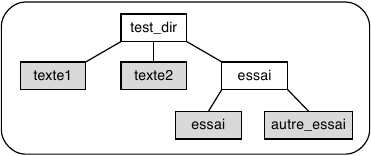
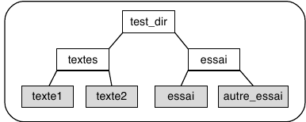

# TD2_UNIX
### 1) Description et utilisation de commandes Unix
#### 1.1 Commande exit
- Permet de sortir du terminal.

#### 1.2 Commandes

```shell
pnom@pc:~$ who
s3b      tty7         2017-09-14 12:31 (:0)

pnom@pc:~$ date
jeudi 14 septembre 2017, 12:33:41 (UTC+0200)

pnom@pc:~$ cal
   Septembre 2017
di lu ma me je ve sa
                1  2
 3  4  5  6  7  8  9
10 11 12 13 14 15 16
17 18 19 20 21 22 23
24 25 26 27 28 29 30

pnom@pc:~$ echo

```
#### 1.3 man cal
- (voir terminal)

#### 1.4 du -sh ~
```shell
pnom@pc:~$ du sh ~
4	/home/s3b/.gnupg/private-keys-v1.d
12	/home/s3b/.gnupg
4	/home/s3b/Public
24	/home/s3b/htop-2.0.2/darwin/.deps
88	/home/s3b/htop-2.0.2/darwin
24	/home/s3b/htop-2.0.2/unsupported/.deps
72	/home/s3b/htop-2.0.2/unsupported
320	/home/s3b/htop-2.0.2/m4
56	/home/s3b/htop-2.0.2/linux/.deps
460	/home/s3b/htop-2.0.2/linux
8	/home/s3b/htop-2.0.2/scripts
...
```
- du : Permet de visualiser l'utilisation du disque dur par l'ensemble des fichiers, récursivement des dossiers.

#### 1.5 man en anglais
```shell
pnom@pc:~$ man -L en du
```

### 2) Interprète de commandes
On peut éditer la ligne de commande :

+   déplacement dans la liste des commandes (historique)

|                          | Explication                                     |
| ------------------------ | ----------------------------------------------- |
| Ctrl + **p** ou **Up**   | (previous) : commande précédente                |
| Ctrl + **n** ou **Down** | (next) : commande suivante                      |
| Ctrl + **r**             | (reverse search) : recherche dans l’historique |

+   déplacement du curseur dans la ligne

|                           | Explication                      |
| ------------------------- | -------------------------------- |
| Ctrl + **a** ou **Home**  | (abcdef...) : début de ligne     |
| Ctrl + **e** ou **End**   | (end) : fin de ligne             |
| Ctrl + **b** ou **Left**  | (backward) : caractère précédent |
| Ctrl + **f** ou **Right** | (forward) : caractère suivant    |

+   suppressions :

|                            | Explication                          |
| -------------------------- | ------------------------------------ |
| Ctrl +  **d** ou **Suppr** | (delete) : caractère sous le curseur |
| **DEL**                    | caractère précédent le curseur       |
| Ctrl +  **k**              | (kill) : jusqu’à la fin de ligne    |

+   validation/annulation

|                      | Explication                                |
| -------------------- | ------------------------------------------ |
| Return ou Ctlr-**j** | validation de la ligne                     |
| Ctrl + **c**         | (cancel) : annulation de la ligne en cours |

## 3) Visite de l'arborescence utilisateur  
### 3.1 Commandes de base  
- pwd = Affiche le nom du répertoire de travail actuel
- cd .. = Remonte l'arborescence d'un étage
- ls = Liste les fichiers et dossiers dans le dossier actuel  

```shell
pnom@pc:~$ pwd  
/home/s3b

pnom@pc:~$ cd ..
pnom@pc:/home$ pwd
/home

pnom@pc:/home$ ls 
s3b
```
### 3.2 TAB  
- TAB permet de compléter automatiquement  

```shell
pnom@pc:/home$ ls e s3b/ //après TAB

pnom@pc:/home$ cd e s3b/
```
### 3.3 Clique molette  
- Clique molette permet de coller dans le terminal un texte préalablement sélectionné  

### 3.4 Bureau  

```shell

pnom@pc:~$ cd Bureau/

pnom@pc:~/Bureau$ pwd
/home/s3b/Bureau

pnom@pc:~/Bureau$ cd
pnom@pc:~$
```
### 3.5 Arborescence dessin


### 3.6 ls -option  

| ls                   | Explication                                                |
| ------------------- | --------------------------------------------------------- |
| -a                   | inclue les entrées cachées (débutant par .)                |
| -A                   | omettre les fichiers « . » et « .. »                       |
| --author             | avec -l, afficher l'auteur de chaque fichier               |
| -b                   | avec -l, afficher l'auteur de chaque fichier               |
| --block-size=TAILLE  | utiliser   cette   TAILLE   de   bloc   pour   l'affichage |
| -B, --ignore-backups | soumettre les entrées se terminant par « ~ »                 |
| -c                   | trier selon différents paramètres                          |
| -C                   | afficher en colonnes                                       |
| -F                   | ajouter un caractère (parmi « */=>@\|») à chaque entrée    |
| -l                   | utiliser un format d'affichage long                        |
| -r                   | inverser l'ordre du tri                                    |
| -t                   | trier selon la date de modification                        |
| -h                   | afficher les tailles en format lisible                     |

```shell
pnom@pc:/$ ls -larth
total 52M
drwxr-xr-x   2 root root 4,0K avril 19  2016 snap
drwxr-xr-x   2 root root 4,0K avril 21  2016 srv
drwxr-xr-x   2 root root 4,0K avril 21  2016 opt
drwxr-xr-x   2 root root 4,0K avril 21  2016 mnt
drwxr-xr-x  11 root root 4,0K avril 21  2016 usr
drwx------   2 root root  16K juil. 10 19:55 lost+found
drwxrwxr-x   2 root root 4,0K juil. 10 20:01 cdrom
drwxr-xr-x   3 root root 4,0K juil. 10 20:04 home
drwxr-xr-x   3 root root 4,0K juil. 10 21:52 media
drwxr-xr-x   2 root root 4,0K juil. 10 22:25 lib64
drwxr-xr-x  25 root root 4,0K juil. 11 10:45 lib
drwxr-xr-x  15 root root 4,0K juil. 11 18:30 var
-rw-------   1 root root  53M juil. 28 19:13 core
lrwxrwxrwx   1 root root   32 sept.  2 12:12 initrd.img.old -> boot/initrd.img-4.4.0-93-generic
lrwxrwxrwx   1 root root   29 sept.  2 12:12 vmlinuz.old -> boot/vmlinuz-4.4.0-93-generic
lrwxrwxrwx   1 root root   33 sept.  2 12:13 initrd.img -> boot/initrd.img-4.10.0-33-generic
lrwxrwxrwx   1 root root   30 sept.  2 12:13 vmlinuz -> boot/vmlinuz-4.10.0-33-generic
drwxr-xr-x  24 root root 4,0K sept.  2 12:13 ..
drwxr-xr-x  24 root root 4,0K sept.  2 12:13 .
drwxr-xr-x   2 root root 4,0K sept. 14 09:46 bin
dr-xr-xr-x 238 root root    0 sept. 15 08:41 proc
dr-xr-xr-x  13 root root    0 sept. 15 08:41 sys
drwxr-xr-x  20 root root 4,1K sept. 15 08:41 dev
drwxr-xr-x  33 root root 1,1K sept. 15 08:42 run
drwxr-xr-x   2 root root  12K sept. 15 08:48 sbin
drwxr-xr-x   5 root root 4,0K sept. 15 08:49 boot
drwx------  10 root root 4,0K sept. 15 08:50 root
drwxr-xr-x 151 root root  12K sept. 15 09:42 etc
drwxrwxrwt  20 root root 4,0K sept. 15 09:58 tmp
```

## 4) Création et supression de répertoire

```shell
pnom@pc:~$ mkdir Projets

pnom@pc:~$ mkdir tmp

pnom@pc:~$ mkdir eclair

pnom@pc:~$ cd eclair/

pnom@pc:~/eclair$ rmdir ../eclair/

pnom@pc:~/eclair$ cd ..

pnom@pc:~$ rmdir eclair
rmdir: échec de suppression de 'eclair': Aucun fichier ou dossier de ce type
pnom@pc:~$ ls -F
backups/                         htop-2.0.2/                   R/
backups_suppr/                   htop-2.0.2.tar.gz             README
Bureau/                          Images/                       resultats.log
casino/                          linux-firmware_1.161_all.deb  selection_vimtutor
correction_premier_programme.py  Modèles/                      sortiefind
deja-dup/                        Musique/                      Téléchargements/
Documents/                       my_ca/                        test_vimtutor
erreurs.log                      nettoyage.sh*                 tmp/
examples.desktop                 nohup.out                     TouchpadIndicator/
fichiers/                        notes.csv.gz                  upgrade
fichiers.tar                     Projets/                      Vidéos/
fichiers.tar.gz                  Public/

pnom@pc:~$ rmdir ~
rmdir: échec de suppression de '/home/s3b': Permission non accordée
```
## 5) Manipilation de fichiers
### 5.1 Copie
```shell
pnom@pc:~$ mkdir test

pnom@pc:~$ cd test

pnom@pc:~/test$ touch doc1.html

pnom@pc:~/test$ touch doc2.html

pnom@pc:~/test$ ls
doc1.html  doc2.html

pnom@pc:~/test$ mkdir ~/temp

pnom@pc:~/test$ cp doc1.html doc2.html ~/temp

pnom@pc:~/test$ ls ~/temp/
doc1.html  doc2.html
```
### 5.2 Suppression
```shell
pnom@pc:~/test$ rm doc2.html

pnom@pc:~/test$ ls
doc1.html

pnom@pc:~/test$ rm ~/temp/doc1.html

pnom@pc:~/test$ ls
doc1.html

pnom@pc:~/test$ cd ~/temp/

pnom@pc:~/temp$ ls
doc2.html

pnom@pc:~/temp$ rm -i doc2.html
rm : supprimer fichier vide 'doc2.html' ? y
```

### 5.3 Déplacement et renommage
```shell
pnom@pc:~$ cd ~/test/

pnom@pc:~/test$ ls
doc1.html

pnom@pc:~/test$ mv doc1.html doc.html

pnom@pc:~/test$ ls -F
doc.html

pnom@pc:~/test$ mv doc.html ..

pnom@pc:~/test$ ls -F

pnom@pc:~/test$ ls -F ..
doc.html

pnom@pc:~/test$ mv ../doc.html .

pnom@pc:~/test$ ls -F ..

pnom@pc:~/test$ ls -F
doc.html
```


```shell
pnom@pcid:~$ mkdir test_dir

pnom@pcid:~$ cd test_dir

pnom@pcid:~/test_dir$ touch texte1

pnom@pcid:~/test_dir$ touch texte2

pnom@pcid:~/test_dir$ ls
texte1  texte2

pnom@pcid:~/test_dir$ mkdir essai

pnom@pcid:~/test_dir$ cd essai

pnom@pcid:~/test_dir/essai$ touch essai

pnom@pcid:~/test_dir/essai$ touch autre_essai

pnom@pcid:~/test_dir/essai$ ls
autre_essai  essai
```

#### 5.4 Placez-vous dans le répertoire test_dir, et ramenez-vous en deux commandes à 
  

```shell
pnom@pcid:~/test_dir$ mkdir textes

pnom@pcid:~/test_dir$ mv texte1 texte2 ./textes
```
#### 5.5 List avec *

```shell
pnom@pcid:~/test_dir/textes$ mv t* ..

pnom@pcid:~/test_dir/textes$ ls

pnom@pcid:~/test_dir/textes$ ls ..
essai  texte1  texte2  textes
```
#### 5.6

```shell
pnom@pc:~/test_dir/textes$ cd ..

pnom@pc:~/test_dir$ cp essai textes
cp: omission du répertoire 'essai'

pnom@pc:~/test_dir$ cp -R  essai textes

pnom@pc:~/test_dir$ ls
essai  textes

pnom@pc:~/test_dir$ cd essai/

pnom@pc:~/test_dir/essai$ ls
texte1.txt  texte2.txt

pnom@pc:~/test_dir/essai$ cd ../textes/

pnom@pc:~/test_dir/textes$ ls
autre_essai.txt  essai  essai.txt
```
