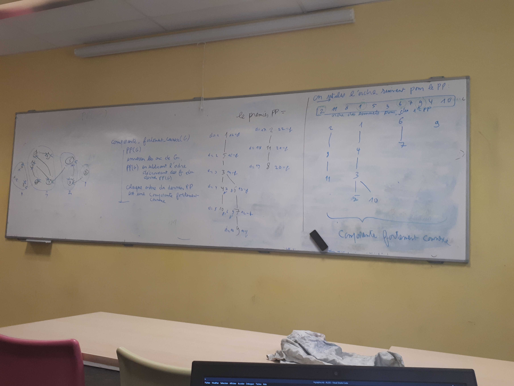
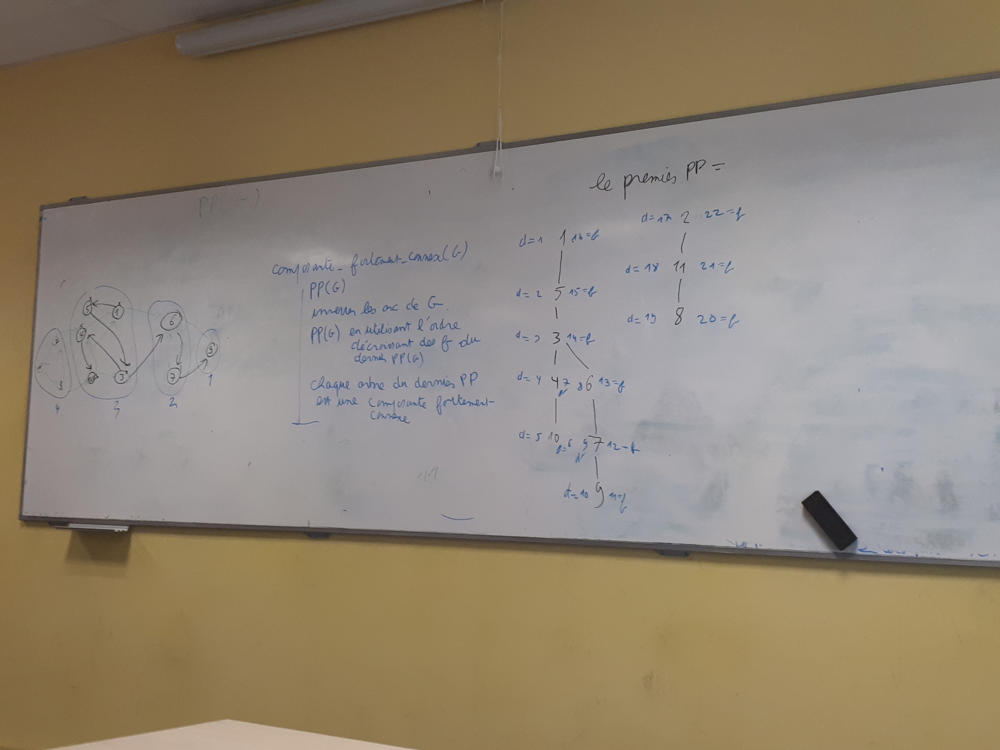
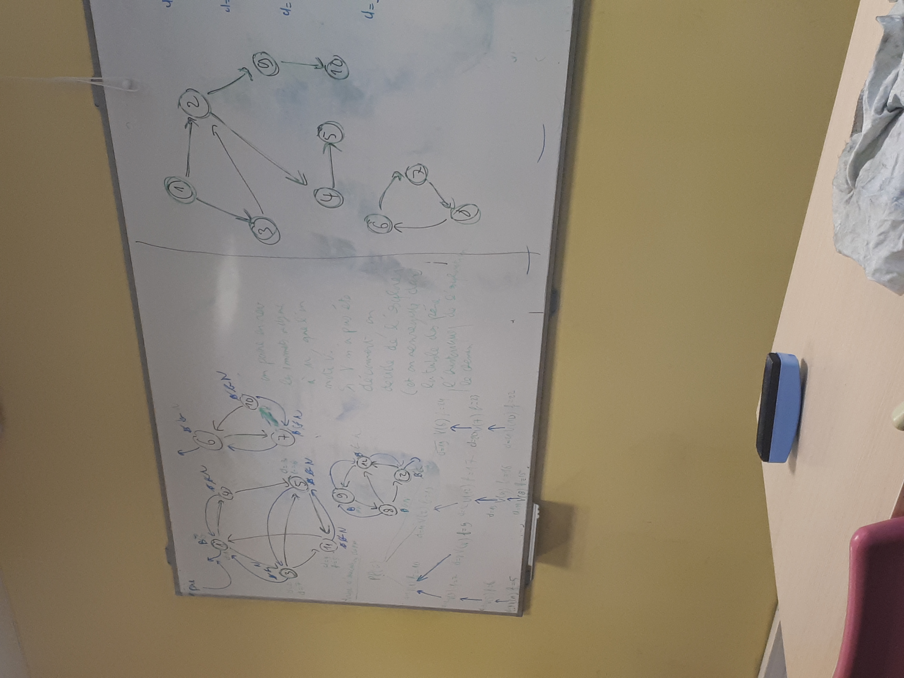
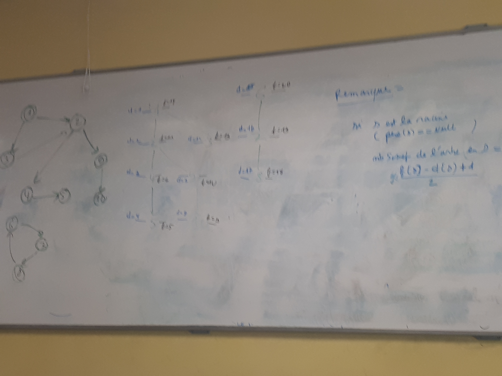
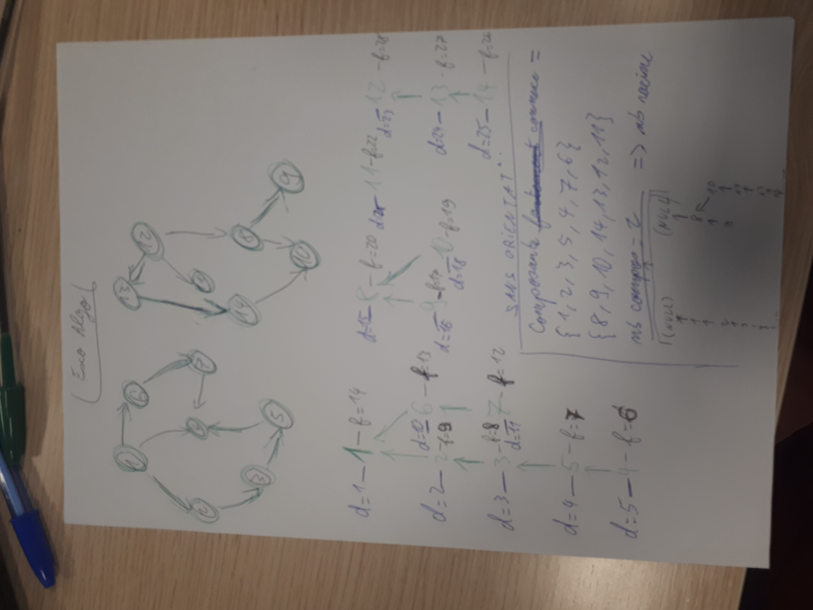
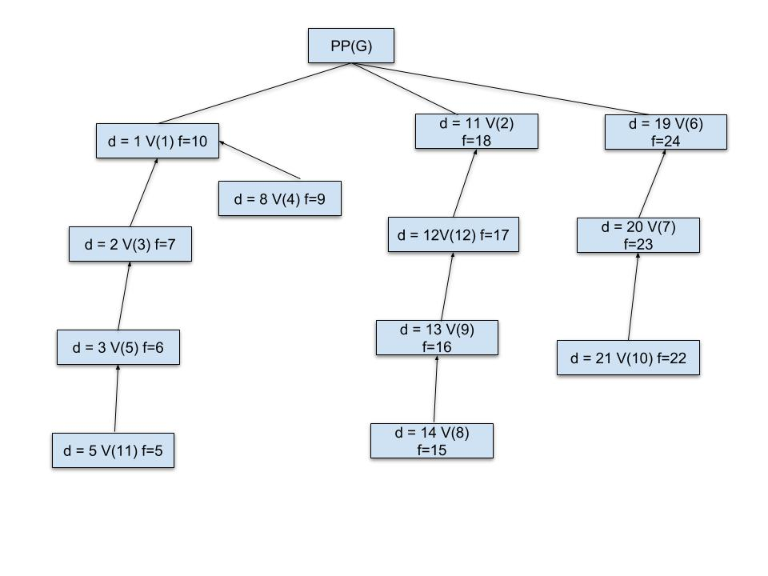

# Théorie des graphes

Deux types d'abres : orienté et non orienté.

[Paulliac INRIA : "Abres"](http://pauillac.inria.fr/~maranget/X/421/poly/arbres.html)

**Référence** : *Graph Theory* Diestel
### Les graphes orientés

Un graphe orienté est un triplet (S,A,&Gamma;) où **S** est un ensemble d'éléments appelés **sommet** du graphe. **A** est un ensemble d'éléments appelés **arcs** et **&Gamma;** est la fonction d'incidence qui est une **application de A dans les paires de sommets** :

**&Gamma; : A &rarr; SxS**

*Par exemple :*

Le graphe **G = (S,A,&Gamma;)** définit par :
+ S = {s1,s2,s3,s4}
+ A = {a1,a2,a3,a4,a5,a6}
+ &Gamma; :
    a1 &rarr; (s1,s2)
    a2 &rarr; (s1,s2)
    a3 &rarr; (s2,s4)
    a4 &rarr; (s4,s2)
    a6 &rarr; (s3,s3)
    a5 &rarr; (s4,s1)

4 sommets et 6 arcs et représente un graphe.

**Exercice** : Donnez la définition mathématiques : (Dessin d'un graphe)

Le graphe **G = (S,A,&Gamma;)** définit par :
+ S = {a,b,c}
+ A = {a1,a2,a3,a4,a5}
+ &Gamma; :
    a1 &rarr; (a,b)
    a2 &rarr; (b,a)
    a3 &rarr; (c,b)
    a4 &rarr; (c,b)
    a5 &rarr; (c,c)

On appelle incidence d'un arc a les sommets &Gamma;(a)[0] et &Gamma;(a)[1].

On appelle origine d'un arc a le sommet &Gamma;(a)[0].

On appelle fin d'un arc a le sommet &Gamma;(a)[1].

Par exemple dans le graphe G précédent, l'arc a2 a pour origine s1 et fin s2.

On appelle boucle les arcs dont la fin et l'origine sont identiques. Par exemple, a6 est une boucle.

### Les graphes non orientés

Un graphe orienté est un triplet (S,A,&Gamma;) où **S** est un ensemble d'éléments appelés **sommet** du graphe. **A** est un ensemble d'éléments appelés **arrêtes** et **&Gamma;** est la fonction d'incidence qui est une **application de A dans un sous-multi-ensembles (sac à patate de M. Boussicault) à 2 éléments de S** :

*Note* : Sac à patate d'objet = multi-ensemble :
+ {{1,1,2,2,3,3}} &rarr; {{1,2,1,3,3,2}}
+ {{1,1,2,2,3,3}} &ne; {{1,2,3,2,3}}

Le graphe **G = (S,A,&Gamma;)** définit par :
+ S = {s1,s2,s3,s4,s5}
+ A = {a1,a2,a3,a4,a5,a6}
+ &Gamma; :
    a1 &rarr; {{s1,s2}} ( = {{s2,s1}} c'est la même chose)
    a2 &rarr; {{s1,s2}}
    a3 &rarr; {{s2,s4}}
    a4 &rarr; {{s4,s2}}
    a6 &rarr; {{s3,s3}}
    a5 &rarr; {{s4,s1}}

*Note* : une paire est une liste à 2 éléments ordonnées (aide à la prog)

**Exercice** :Donnez la définition mathématiques du graphe suivant :
Le graphe **G = (S,A,&Gamma;)** définit par :
+ S = {s1,s2,s3,s4}
+ A = {a1,a2,a3,a4}
+ &Gamma; :
    a1 &rarr; {{s4,s1}}
    a2 &rarr; {{s1,s4}}
    a3 &rarr; {{s2,s3}}
    a4 &rarr; {{s4,s4}}

### Le Bestaire

#### Les graphes complets
Les graphes complets sont des graphes non orienté à n sommets tels que toute paires de sommet est relié par arrêtes (pentagramme étoile).

Définition allégé :

Kn = (\[[1,n]], &Gamma;) &Gamma; = {{i,j}} i < j et i = \[[1,n]] et j = \[[1,n]]}

**Exemple** :

+ S = Sommet de L = {1,2,3,4}
+ &Gamma; = Arrêtes de L = { {{1,2}} , {{1,3}} , {{1,4}} , {{[[1,n]]2,3}} , {{2,4}} , {{3,4}} }

#### Les graphes bipartis
Un graphe biparti est un graphe non orienté tels que l'ensemble des sommets peut être partitionné en deux sous-ensemble A et B disjoint (pléonasme).

### Suite algo (19/03/2018)
(si quelqu'un à la partie précédente svp ^^)
+ degrès
+ matrice d'adjacence 

[Théorie des graphes-Nymphomath](https://www.apprendre-en-ligne.net/graphes/graphes.pdf)
[Théorie des graphes-Nymphomath Corrige](https://www.apprendre-en-ligne.net/graphes/corriges.pdf)

[Wikipédia produit matriciel](https://fr.wikipedia.org/wiki/Matrice_d%27incidence)
### Liste d'adjacence

Le graphe peut être représenté par une liste d'adjacence, il s'agit d'un tableau T indexé par le sommet de G et dont l'élément T[s] associés à un sommet s de G est une référence à une liste contenant toutes les fins des arrêtes dont l'origine est s.

*Exemple* : 
+ T:{1:[1,1,2,2],2:[1],3:[]} version orientée

### Matrice d'incidence

Un graphe G **sans boucle** peut être codé à l'aide d'une matrice d'incidence M définie par : (Mi,e)i &isin; sommet;e &isin; arcs.

Le coefficient (Mi,e) est égal à {+1 si i est la fin de e ; -1 si i est l'origine de e; 0 sinon}.

[Wikipédia matrice incidence](https://fr.wikipedia.org/wiki/Matrice_d%27incidence)

**Remarque** : On peut gérer les boucles, il suffi de décider que :

Mi,e) est égal à {+1 si i est la fin de e et e pas une boucle ; -1 si i est l'origine de e et e pas une boucle;2 si e est une boucle de i; 0 sinon}.

Mais on perd l'algébricité de la structure et on ne peut plus faire de calcul matriciel. 

**Remarque**: On peut faire la même chose pour un graphe non orienté : 

Mi,e) est égal à {+1 si i est un sommet de e et e pas une boucle ; 2 si e est une boucle en i; 0 sinon}.

*Note* : Ordonnée matrice = sommet ; Abscisse matrice = arcs

## Exploration d'un graphe

### Chaîne, chemin, cycle et circuit

Une **chaîne** de longueur q > 0 est une séquence d'arcs/arêtes (a1,a2,...,aq) de G telle que chaque arc/arête de la séquence a une extrémité en commun avec l'arc précédent et l'autre extrémité en commun avec l'arc/arête suivant.

La chaîne ne suit pas l'orientation des arcs. 

[Wikipédia : chaîne (théorie des graphes)](https://fr.wikipedia.org/wiki/Cha%C3%AEne_(th%C3%A9orie_des_graphes))

Un **chemin** de longueur q est une chaîne (U1,U2,...,Uaq) telle que pour tout arcs Ui, la fin de Ui est l'origine de Ui+1 et l'origine l'origine de Ui est la fin de Ui+1.

On écrit aussi les chaines et les chemins avec leurs sommets quand cela aide à la lisibilité. Dans ce cas la séquence :

(s1,e1,s2,e2,...., sk,ek) est une chaîne/chemin tels que :
+ si et si+1 sont les extrémités de ei pour une chaîne.
+ si et si+1 sont respectivement l'origine et la fin de ei pour un arc.

Dans cette notation on peut avoir une chaine/chemin vide d'origine le sommet s, il s'agit de : (s).

Une **chaîne élémentaire** est une chaîne qui ne rencontre pas deux fois le même sommet.

Un **cycle élémentaire** est une chaine élémentaire dont le premier sommet de la chaîne est le dernier sommet de la chaine et dont la chaine passe une, et une seule fois, par sommet à l'exception du premier et dernier sommet.

Un **circuit** est un chemin dont le premier est identiques au dernier sommet du chemin .

Un **cycle** est une chaine dont le premier est identique au dernier sommet.

**Attention** : souvent les gens confondent cycle et cycle élémentaire et "cyle qui contient un cycle élémentaire"(un cycle si on enlève recursivement les palindromes de la séquence, on obtient un cycle élémentaire).

Un **circuit élémentaire** est un circuit qui ne passe pas deux fois par le même sommet ormis l'origine et la fin.

Un **chemin est élémentaire** si il ne passe pas deux fois par le même sommet.

Notation Absurde : si il n'y a pas d'ambiguité, on enlève les arêtes de la requête pour ne garder que les sommets. 

| Orienté            | Orienté et non orienté |
| ------------------ | ---------------------- |
| Chemin             | Chaîne                 |
| Chemin élémentaire | Chaîne non élémentaire |
| Cycle              | Circuit                |
| Cycle élémentaire  | Circuit élémentaire    |

## Exo durant le cours

#### Paramètres de chemins

La taille d'un chemin/chaîne est le nombre d'arrête contenu dans le chemin/chaîne.  
On appelle composante connexe d'un graphe tout sous ensemble MAXIMAL de sommets tel que pour tout couple de sommets(u,v) de ce sous ensemble il existe une chaîne qui relie u à v. 

#### Fonctions de chemins
Soit $p = ( s _0 , e _0, s _1 , e _1, ..., s _{k-1} , e _{k-1}, s _k )$  
Soit $q = ( t _0 , f _0, t _1 , f _1, ..., t _{k-1} , f _{k-1}, t _k )$  
Deux chemins/ chaînes.  
Si $t _0$ = $s _{k+1}$ alors on peut construire un nouveau chemin noté $p.q$ et appelée concaténation de $p$ avec $q$ et définie par :
$$p.q = ( s _0 , e _0, s _1 , e _1, ..., s _{k-1} , e _{k-1}, s _k , f _0, t _1 , f _1, ..., t _{k-1} , f _{k-1}, t _k )$$ 
Exemple :  
$$(0,a,5,b,8).(8,d,5,e,4) = (0,a,5,b,8,d,5,e,4)$$

On appelle $\Phi(W)$ l'opération qui à un chemin/chaîne w renvoie le chemin/chaîne u.v tel que
$$
    \Phi(W)= 
\begin{cases}
    u.v,& \text{si il existe }i , j \text{ deux sommets distincts et } \alpha \text{ un arc/arrête tel que }\\
    & W = u.(i,\alpha, j, \alpha, i) . v \\
    & \text{ et tel que u est de taille minimale}\\
    W,              & \text{sinon}
\end{cases}
$$ 
> Remarque :  
> Pour tout cycle/chemin, $\forall n \in \mathbb{N} \Rightarrow \Phi ^n (c) = \Phi ^{n+1} (c)$. On note par $\Phi ^\infty (c)$ le cycle $\Phi ^n (c)$.  
> On appelle cycle non trivial tout cycle tel que $taille(\Phi ^\infty (c)\ne 0)$

Si $C$ est un cycle/circuit non trivial alors $\Phi ^\infty (c)$ contient un cycle/circuit élémentaire dans le sens qu'il existe des chemins $u,v,w$ tel que $\Phi ^\infty (c) = u.v.w$ et $v$ est un cycle/circuit élémentaire  

> Définition :  
> Un arbre est un graphe connexe et sans cycles non triviaux