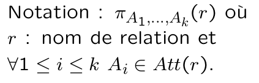
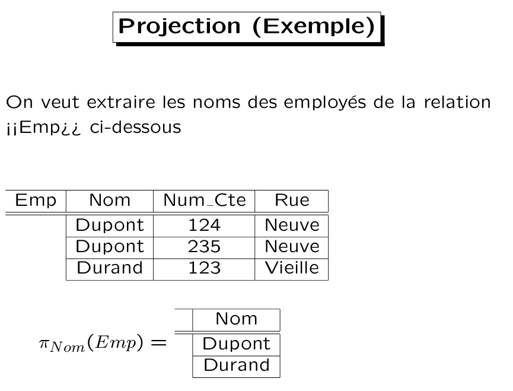
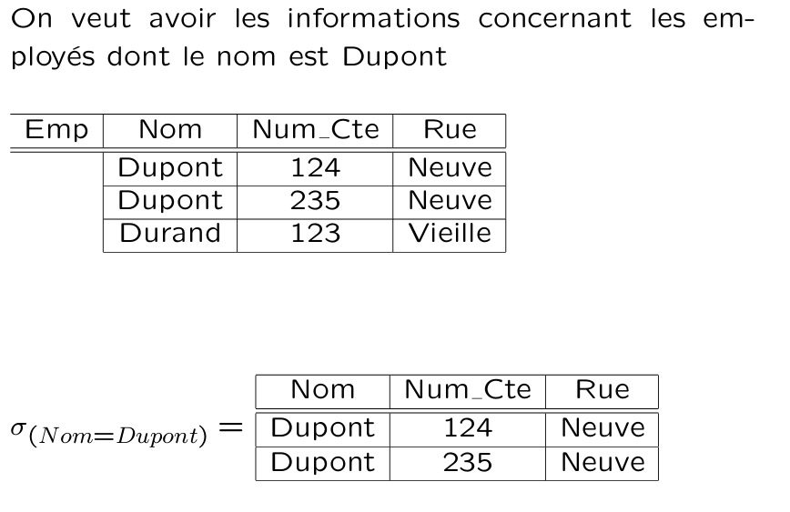
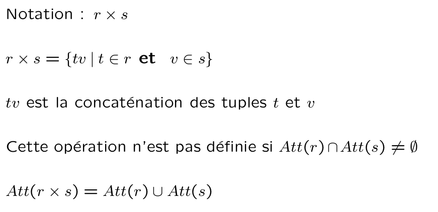
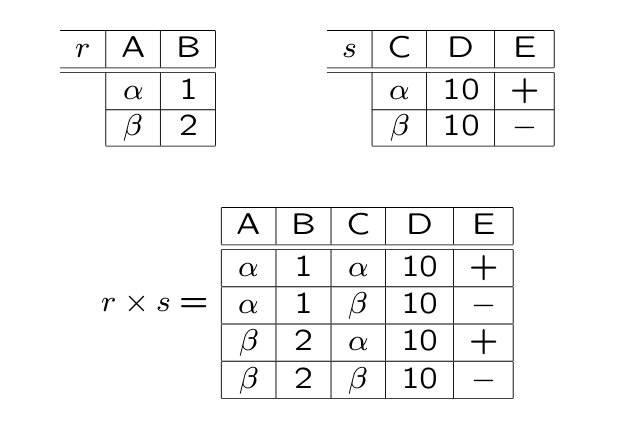
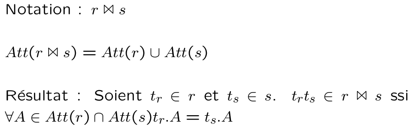
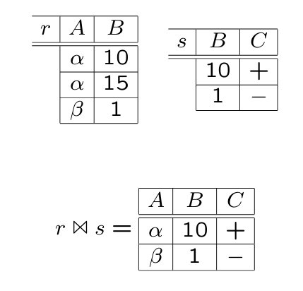
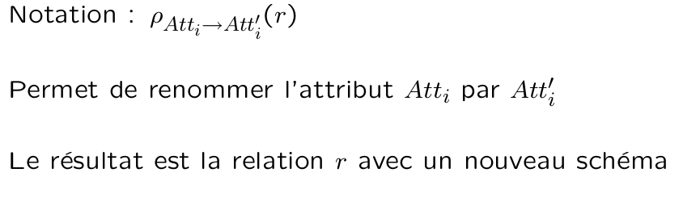
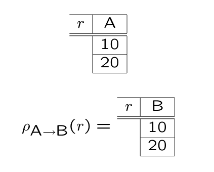
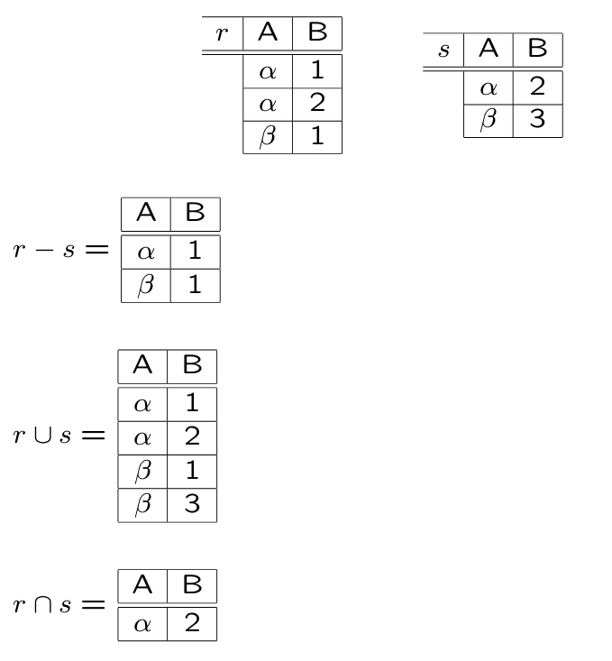

# Base de donnée

Mail : maabout@labri.fr

Réf PDF : www.labri.fr/~maabout/M1BI

## I-Définitions
### Une base de donnée relationnelle
Une relation est une **table** (tableau) où chaque colonne définie un **attribut** (ou champ) et chaque ligne désigne un **enregistrement** (tuple ou n-tuplet).
Chaque relation a un **nom**.


**Contraintes**:
+ 2 relations de la même BD ont forcément des noms différents.
+ 2 attributs de la même relation ont forcément des nom différents
Remarque : 2 attributs qui se trouvent dans 2 tables différentes peuvent avoir le même nom.

*Exemple*:
Dans une base, on peut avoir des tables:
+ Employé (**N°SS**,Nom,Ville,Salaire,*N°Service*)
+ Service (*N°Service*,Nom,Etage,**Responsable**)

Note : 
+ N°Service permet d'établir une relation entre l'employé et le service. 
+ Nom est différent entre les deux tables. 
+ Responsable devra utiliser un lien unique pour identifier un employé : deux attributs ont un nom différent mais ont la même info (N°SS).

### Système de gestion de base de données (SGBD)
Système (logiciel) qui permet de gérer des bases données.
+ Créer 
+ Modifier
+ Interroger 

*Exemple de SGBD*: MySQL, **Postgres**, Access, SQL Servor, Oracle , ...

## II-Langage de requête
### 1-Algebre relationnelle
Composée d'un ensemble d'**opérations**. Certaines sont **unaires** (une seule table comme paramètre), d'autres sont **binaires** (exemple : addition est une opération binaire).

#### 1.1-Projection
Prend une table et supprime certaines colonnes.

*Notation* : 




Noter que par défaut les doublons ne sont pas éliminés mais il est possible de spécifier une option afin de les éviter (50 employés à Pessac et 20 à Bx : Ville? on aura une table avec deux lignes Bx et Pessac).

#### 1.2-Sélection
Permet d'extraire des lignes d'une table qui satisfait une condition.

*Notation*:


*Exemple*:


#### 1.3-Produit cartésien:
Permet de **concaténer** chaque ligne d'une table à chaque ligne d'une deuxième table.

*Notation*:


*Remarques* : 
+ les attributs de la table résultant du produit sont ceux de 2 tables.
*Exemple* : R(A,B) * S(C,D,E) &rarr; Résultat(A,B,C,D,E)


Note : Nombre de ligne de Résultat = nombre de ligne de R * nombre de ligne de S

+ Cas où un même nom d'attribut apparaît dans les 2 tables : 

Ex : R(A,B) \* S(B,C) &rarr; Résultat(A,**R.B**,**S.B**,C)

+ le résultat de chaque opération de l'algèbre est une table. On peut donc combiner plusieurs opéartions successives.

Ex : afficher le nom des employés habitant Pessac.

&pi;;<sub>Nom</sub> (&sigma;<sub>Vile = Pessac</sub>)(Employé)) &rarr; Résultat = {"Nom" :[Dupont,Martin]}

On a d'abord fait une sélection et on a ensuite appliqué la projection.

Ex : afficher le nom des employés qui travaillent au Service Compta. 
+ On extrait le n° du Service dont le nom est Compta.

&pi;<sub>N°Service</sub> (&sigma;<sub>NomService = Compta</sub>(Service)) &rarr; Res1 : {"N°Service" : [1]}

+ On combine Res 1 avec Employé :

Employé * Res1 &rarr; Res2 = {"N°SS":[123,321,312],"Nom":[Dupond,Dupont,Martin],"Ville":[Bx,Pessac,Pessac],"Employé.N°Service":[1,1,2],"Res1.N°Service":[1,1,1]}

+ On sélectionne le nom des employés où il y a égalité des N°Service.

&pi;<sub>Nom</sub> (&sigma;<sub>Employé.N°Service = Res1.N°Service</sub>(Res2)) &rarr; Res3={"Nom":[Dupond,Dupond]}

#### 1.4-Jointure
C'est un cas particulier de produit cartésien : 2 lignes sont concaténées si et seulement si elles ont les mêmes valeurs sur les attributs communs : 

*Notation* : 


*Exemple* :


#### 1.5-Renommage
Permet de changer le nom d'un ou de pluseiurs attributs.

*Notation* : 


*Exemple*


Ex : &pi;<sub>Nom</sub> (&sigma;<sub>Nom Service = Compta</sub>(&rho;<sub>Resp &rarr; N°SS</sub>(Service)&#8883;&8882;Employé))

#### 1.6-Opération ensembliste : Union, Intersection, Différence
*Notation* : 


*Exemple* : 


Ex : 
+ Afficher le nom et N°SS des employés qui sont aussi étudiants 

&pi;<sub>N°SS,Nom</sub>(Employé) &#8898; &pi;<sub>N°SS,Nom</sub>(Etudiant)

+ Afficher les étduiants qui ne sont pas employés

&pi;<sub>N°SS,Nom</sub>(Etudiant) - &pi;<sub>N°SS,Nom</sub>(Employé)

+ Afficher les personnes qui ont une adresse mail à l'université

&pi;<sub>N°SS,Nom</sub>(Employé) &#8899; &pi;<sub>N°SS,Nom</sub>(Etudiant)

### TD-1 : Requêtes 
1- Afficher le nom des personnes qui habitent Koudalou

+ &pi;<sub>NomOccupant</sub>(&sigma;<sub>NomImmeuble=Koudalou</sub>(Occupant))

2- Afficher le nom des immeubles.

NomImmeuble : attribut retourvé dans table Immeuble, Appart et Occupant. Mais la table Immeuble est censé contenir tous les immeubles : projection.

+ &pi;<sub>NomImmeuble</sub>(Immeuble)

3- Superficie de l'appart occupé par Rachel

+ Occupant **&#8883;&#8882;** Appart &rarr; 5 lignes et 6 colonnes
+ &pi;<sub>Superficie</sub>(&sigma;<sub>NomOccupant = Rachel</sub>(Occupant **&#8883;&#8882;** Appart))

*Remarque* : on a le même résultat avec 
+ &pi;<sub>Superficie</sub>(&sigma;<sub>NomOccupant = Rachel</sub>(Occupant) **&#8883;&#8882;** Appart) 

4- Profession du gérant de l'immeuble où Rachel habite

+ &sigma;<sub>NomOccupant = Rachel</sub>(Occupant) &rarr; Res1
+ Res1 **&#8883;&#8882;** Immeuble &rarr; Res2 (1 ligne et 8 colonnes)
+ &rho;<sub>NomGérant &rarr; Nom</sub> &rarr; Res3 
+ Res3 **&#8883;&#8882;** Personne &rarr; Res4 (1ligne et 10 colonnes)
+ &pi;<sub>Profession</sub>(Res4) 

**Résultat**:

|Profession|
|---------|
|Rentier|

5- Afficher la superficie de l'appart occupé par Rachel ainsi que la profession du gérant de cet appart

+ &sigma;<sub>NomOccupant = Rachel</sub>(Occupant) &rarr; Res1
+ Res1 **&#8883;&#8882;** Appart &rarr; Res2
+ Res2 **&#8883;&#8882;** Immeuble &rarr; Res3
+ &rho;<sub>NomGérant &rarr; Nom</sub> &rarr; Res4 
+ Res4 **&#8883;&#8882;** Personne &rarr; Res5
+ &pi;<sub>Superficie,Profession</sub>(Res5) 

6- Afficher ke N° et le nom d'immeuble des apparts qui ne sont pas occupés

+ &pi;<sub>NomImmeuble,N°Appart</sub>(Appart) - &pi;<sub>NomImmeuble,N°Appart</sub>(Occupant)

7- Le nom des immeubles dont tous les apparts sont occupés.

*Principe* : l'ensemble de tous les immeubles moins ceux qui ont au moins un appartement libre

+ &pi;<sub>NomImmeuble</sub>(Immeuble) &rarr; Res1
+ &pi;<sub>NomImmeuble</sub>(&pi;<sub>NomImmeuble,N°Appart</sub>(Appart) - &pi;<sub>NomImmeuble,N°Appart</sub>(Occupant)) &rarr; Res2
+ Res1 - Res2 

**Resultat** : 

|NomImmeuble|
|---------|
|Barabas|
 
 8- Afficher les paires de personnes qui sont voisines cad habitent le même immeuble

+ &pi;<sub>NomImmeuble,NomOccupant</sub>(Occupant) &rarr; Res1

|NomImmeuble|NomOccupant|
|-----------|-----------|
|K          | Ra        |
|B          | D         |
|B          | Ro        |
|K          | W         |
|K          | A         |

+ &rho;<sub> NomOccupant &rarr; NomOccupant1</sub>(&pi;<sub>NomImmeuble,NomOccupant</sub>(Occupant)) &rarr; Res2

+ Res1 **&#8883;&#8882;** Res2 &rarr; Res3 (NomImmeuble,NomOccupant,NomOccupant1)

|NomImmeuble|NomOccupant|NomOccupant1|
|-----------|-----------|------------|
|K          | Ra        |Ra          |
|K          |Ra         |W           |
|K          |Ra         |A           |
|B          |D          |D           |
|B          | D         |Ro          |
|B          |Ro         |D           |
|B          | Ro        |Ro          |
|K          |W          |Ra          |
|K          |W          |W           |
|K          | W         |A           |
|K          |A          |Ra          |
|K          |A          |W           |
|K          |A          |A           |

Pour éliminer les liges où on a le même nom, il suffit de sélectionner celles où les noms sont différents.

+ &sigma;<sub>NomOccupant != NomOccupant1</sub>(Res3) &rarr; Res4

Pour éviter les paires de type (Ra,W) et (W,Ra), il suffit de comparer les deux noms : 

+ &sigma;<sub>NomOccupant < NomOccupant1 </sub>(Res4) &rarr; Res5

> Note : le **<** s'applique aux caractères (ordre alpahabetique) 

9- Afficher le nom des personnes qui sont arrivés après Doug

Année d'arrivée de Doug:

+ &pi;<sub>AnnéeArrivée</sub>(&sigma;<sub>NomOccupant=Doug</sub>(Occupant)) &rarr; Res1
+ Occupant * Res1 &rarr; Res2
+ &pi;<sub>NomOccupant</sub>(&sigma;<sub>Occupant.AnnéeArrivée > Res1.AnnéeArrivée</sub>(Res2))

### SQL

+ Structured (ou Simple) Query Language
+ Standard qui permet d'exprimer des requêtes dans une BDD relationnelle.

Forme générale d'une requête SQL : 

|Clause     |Fonction   |
|-----------|-----------|
|SELECT     |Attributs  |
|FROM       |Tables     |
|WHERE      |Conditions |

+ FROM correspond au produit cartésien des tables mentionnées
+ WHERE correspond à la sélection sur le résultat du produit cartésien
+ SELECT correspond à la projection sur les résultats

**Exemples**:
+ Ex1

```sql
2- SELECT   NomImmeuble
1- FROM     Immeuble
```
est équivalent à : &pi;<sub>NomImmeuble</sub>(Immeuble)

Résultat : 

|NomImmeuble|
|-----------|
|Koudalou   |
|Barabas    |

+ Ex2
```sql
3- SELECT   NomImmeuble
1- FROM     Immeuble
2- WHERE    NomGérant = Doug
```

est équivalent à : &pi;<sub>NomImmeuble</sub>(&sigma;<sub>NomGérant=Doug</sub>(Immeuble))

|NomImmeuble|
|-----------|
|Kandalou   |
|Koudalou   |
|Barabas    |
|.          |
|.          |
|.          |
|Barabas    |

*Remarque*: SQL n'élimine pas les doublons.

```sql
SELECT      NomImmeuble
FROM        Appart
```
Pour éliminer les doublons, on utilise la **clause DISTINCT**.

```sql
SELECT      DISTINCT    NomImmeuble
FROM        Appart
```

+ Ex3
La profession du gérant de Koudalou.

```sql
SELECT      Profession
FROM        Personne,Immeuble
WHERE       NomGérant = Nom
```


## III-Insertion, Suppression, Modification
### Modification de la structure d'une BD
## IV-Contrainte d'intégrité
## V-Conception d'une BD
