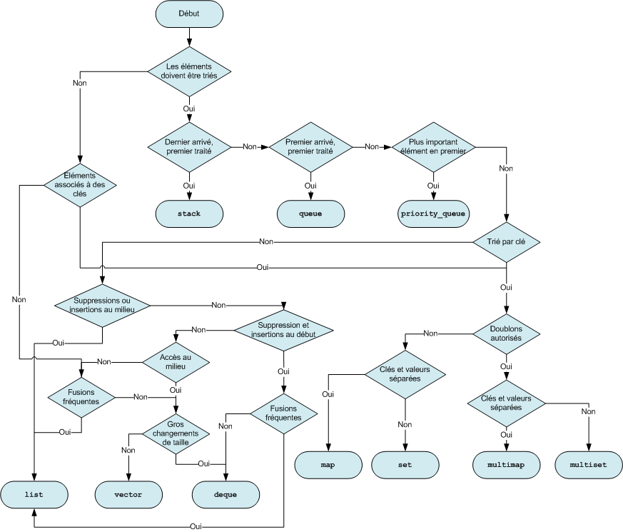
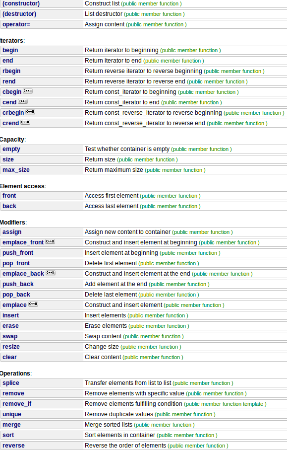
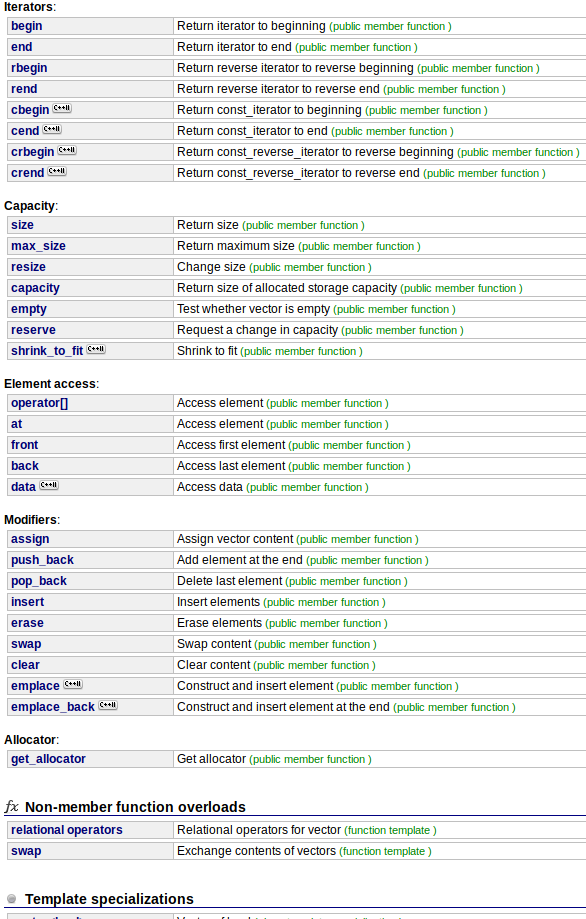
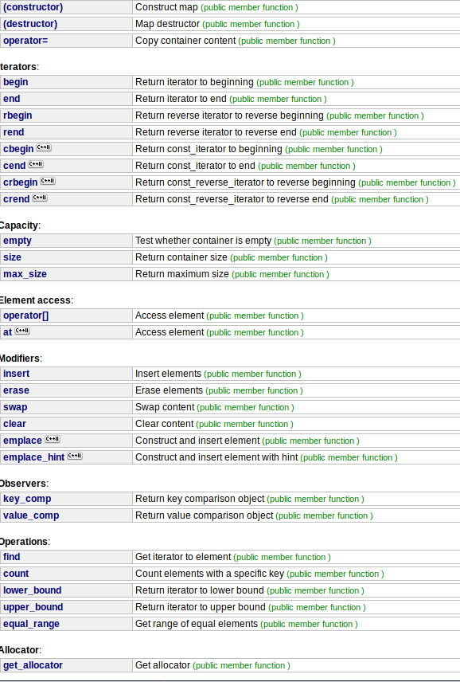

# 1. Fiche Révision C++
- [1. Fiche Révision C++](#1-fiche-r%C3%A9vision-c)
  - [1.1. Concepts de base](#11-concepts-de-base)
    - [1.1.1. Namespace](#111-namespace)
    - [1.1.2. Flux entrants et sortants](#112-flux-entrants-et-sortants)
    - [1.1.3. Pointeurs](#113-pointeurs)
    - [1.1.4. Allocation dynamique ou automatique](#114-allocation-dynamique-ou-automatique)
    - [1.1.5. Tableaux](#115-tableaux)
    - [1.1.6. CString](#116-cstring)
    - [1.1.7. const](#117-const)
    - [1.1.8. static](#118-static)
    - [1.1.9. virtual](#119-virtual)
    - [1.1.10. friend](#1110-friend)
  - [1.2. Conversions](#12-conversions)
    - [1.2.1. Variables numériques -> Variables numériques](#121-variables-num%C3%A9riques---variables-num%C3%A9riques)
    - [1.2.2. Variables numériques -> std::string](#122-variables-num%C3%A9riques---stdstring)
    - [1.2.3. char -> int](#123-char---int)
  - [1.3. Éléments de POO](#13-%C3%A9l%C3%A9ments-de-poo)
    - [1.3.1. Constructeur par défaut](#131-constructeur-par-d%C3%A9faut)
    - [1.3.2. Constructeur par copie](#132-constructeur-par-copie)
    - [1.3.3. Constructeur classique](#133-constructeur-classique)
    - [1.3.4. Destructeur](#134-destructeur)
    - [1.3.5. Accesseur](#135-accesseur)
    - [1.3.6. Mutateur](#136-mutateur)
    - [1.3.7. Héritage](#137-h%C3%A9ritage)
    - [1.3.8. Classes abstraites](#138-classes-abstraites)
    - [1.3.9. Templates](#139-templates)
    - [Surcharge opérateur](#surcharge-op%C3%A9rateur)
  - [1.4. Bibliothèque standard](#14-biblioth%C3%A8que-standard)
    - [1.4.1. std::string](#141-stdstring)
    - [1.4.2. Exceptions standards](#142-exceptions-standards)
    - [1.4.3. Conteneurs standards](#143-conteneurs-standards)
      - [1.4.3.1. Bien choisir son conteneur](#1431-bien-choisir-son-conteneur)
      - [1.4.3.2. iterator](#1432-iterator)
      - [1.4.3.3. std::list](#1433-stdlist)
      - [1.4.3.4. std::vector](#1434-stdvector)
      - [1.4.3.5. std::map](#1435-stdmap)
    - [1.4.4. Algorithmes standards](#144-algorithmes-standards)
## 1.1. Concepts de base
### 1.1.1. Namespace
Un namespace est un ensemble de méthodes, variables, constante et classes qui permet de délimiter la portée de ces éléments.  
Concrètement, le plus commun est le namespace `std` et il contient les éléments standards de c++.  
Les méthodes d'un namespace sont accessibles à l'aide de l'opérateur de résolution de portée `::`
```c++
std::cout
```

Afin d'éviter de devoir préciser à chaque utilisation le namespace de votre choix, il est possible d'utiliser 
```c++
using namespace std;
```
qui permet alors par la suite d'utiliser 
```c++
cout
```
> ATTENTION  
> Ne pas utiliser `using namespace std` dans un header (.h / .hpp) car sinon il sera vrai partout après le 
> ```c++
> #include "ClassName.h"
> ```
> même là où il peut pauser des problèmes de surcharge !!!

### 1.1.2. Flux entrants et sortants
Afin d'interagir avec l'utilisateur, on utilise les entrées et sorties standards qui sont accessibles en tant que flux respectivement à l'aide de `std::cin` et de `std::cout`.
> Pour pouvoir les utiliser, il  faut préalablement   
> `#include <iostream>`


### 1.1.3. Pointeurs
Un pointeur ets une variable qui contient l'adresse d'une autre variable typée.  
Exemple :
```c++
int main () {
    int a = 6;
    int * pA = &a; // &  récupère l'adresse de la variable a
    cout << *pA << endl; // * récupère la valeur pointée par le pointeur pA
}
```
### 1.1.4. Allocation dynamique ou automatique
De base dans c++, les allocations sont automatiques, c'ets à dire que les variables sont détruites à la sortie du bloc d'exécution courant.  
On peut cependant modifier ce comportement pour gérer la destruction de l'objet en temps voulu (appel au destructeur via `delete`).  
Pour allouer dynamiquement, il faut utiliser le mot clé `new` et le résultat est forcément un pointeur :
```c++
int main () {
    int * a = new int(6);
    ClassName * instance = new ClassName(arg, ...);
}
```

### 1.1.5. Tableaux
Un tableau est un espace de stockage défini, alloué et contigu dans la mémoire. Il est en réalité un pointeur vers le premier élément et s'arrête à la fin grâce au caractère d'échappement `'\0'`.  
**Exemple :**
```c++
int main () {
    int tableau[20];
    tableau[5] = 6;
    *(tableau + 5 * size_of(int)) = 6;
    int * tableauB = new int[20]
    delete[] tableauB;
}
```

Les tableaux permettent l'utilisation de méthodes particulières à partir de `<cstring>`:
- memcpy (* dest, * src)   => copie le contenu de la source dans la dest
- memmove (* dest, * src) =>  coupe le contenu de la source dans la dest

Afin de récupérer le nombre d'éléments dans un de ces tableaux, on doit faire :
```c++
int main () {
    ClassName tabClassName[20];
    std::size_t taille = sizeof(tabClassName) / sizeof(tabClassName[0]);
}
```
> `size_t` étant un type standard équivalent à un long entier non signé, donc compris dans $[0:2^{16}[$
### 1.1.6. CString
Un string en C pure est un une chaîne de caractères, c'est à dire un tableau de caractères.  
Étant des tableaux, ils se déclarent donc comme ces derniers :
```c++
int main () {
    char texte[20];
    char * texteBis = new char[20];
    delete[] texteBis;
}
```
On peut exécuter nombre de fonctions contenus dans `<cstring>`:
- memcpy (* dest, * src)   => copie le contenu de la source dans la dest
- memmove (* dest, * src) =>  coupe le contenu de la source dans la dest
- strcpy (* dest, * src) => copier le string
- strcat (* dest, * src) => concatène la src dans le dest. Attention à avoir assez d'espace allouer à la dest.
- strchr (const char * src, int c) => renvoie un pointeur vers la première occurrence du char c dans src
- strcmp ( const char * str1, const char * str2 ) => compare les deux string et retourne un entier négatif si alphabétiquement str1 < str2, 0 si égaux, positif si str1 > str2


### 1.1.7. const
> La variable associée ne peut être modifiée après l'initialisation  
> Si placé à la fin du prototype d'une méthode, alors précise que la méthode ne modifieras pas l'instance. 
```c++
ReturnType methodName (TypeArg arg, ...) const;
```

### 1.1.8. static
> La variable associé est stockée dans un espace hors de la pile d'execution et est donc accessible depuis n'importe où sur cette pile.

### 1.1.9. virtual
> Permet le polymorphisme dans le cadre de l'héritage en spécifiant que la ligature doit se faire dynamiquement. C'est à dire que les méthodes sont liées au type réel de la variable, même si celle-ci est pointé par un pointeur d'une classe mère

### 1.1.10. friend
> Donne accès à la méthode ou la classe déclarée comme friend aux attributs privés, pratique pour la surcharge des opérateurs afin de respecter l'arité de l'opérateur (le nombre d'éléments dans l'opération)

## 1.2. Conversions
### 1.2.1. Variables numériques -> Variables numériques
Grosso merdo plutôt OK, penser à utiliser `floor`, `ceil`, `round` pour passer de chiffre à virgule à sans virgule. Ces méthodes sont disponibles dans `<cmath>`.  
Attention également à ne pas dépasser les limites mémoires quan don passe d'un long à un int par exemple.
### 1.2.2. Variables numériques -> std::string
```c++
int main () {
    int a = 666;
    std::string invocation = "Allo " +std::to_string(a) + ", le numéro du père Noël"
}
```
### 1.2.3. char -> int
```c++
int main () {
    char a = 'A';
    int b = a; // Position de A dans la table ASCII
}
```

## 1.3. Éléments de POO
### 1.3.1. Constructeur par défaut
**Header** (compilation non nécessaire)
```c++
#ifndef EXEMPLE_CONSTRUCTEUR_DEFAULT
#define EXEMPLE_CONSTRUCTEUR_DEFAULT

class ClassName {
private:
    Type attribut;
    ...
public:
    ClassName();
};
#endif //EXEMPLE_CONSTRUCTEUR_DEFAULT
```
**Source** (compilation nécessaire)
```c++
#include "ClassName.h"

ClassName::ClassName() : attribut(valeur_par_défaut), ... {

}
```
**Utilisation** (compilation nécessaire)
```c++
#include "ClassName.h"

int main () {
    ClassName a;
    ClassName b();
    ClassName * c = new ClassName;
    ClassName * d = new ClassName();
    return 0;
}
```

### 1.3.2. Constructeur par copie
**Header** (compilation non nécessaire)
```c++
#ifndef EXEMPLE_CONSTRUCTEUR_COPIE
#define EXEMPLE_CONSTRUCTEUR_COPIE

class ClassName {
private:
    Type attribut;
    ...
public:
    ClassName(const ClassName & src);
};
#endif //EXEMPLE_CONSTRUCTEUR_COPIE
```
**Source** (compilation nécessaire)
```c++
#include "ClassName.h"

ClassName::ClassName(const ClassName & src) : attribut(src.attribut), ... {

}
```
**Utilisation** (compilation nécessaire)
```c++
#include "ClassName.h"

int main () {
    ClassName a;
    ClassName b = a;
    return 0;
}
```
### 1.3.3. Constructeur classique
**Header** (compilation non nécessaire)
```c++
#ifndef EXEMPLE_CONSTRUCTEUR_CLASSIQUE
#define EXEMPLE_CONSTRUCTEUR_CLASSIQUE

class ClassName {
private:
    Type attribut;
    ...
public:
    ClassName(Type attribut, ...);
};
#endif //EXEMPLE_CONSTRUCTEUR_CLASSIQUE
```
**Source** (compilation nécessaire)
```c++
#include "ClassName.h"

ClassName::ClassName(Type attribut, ...) : attribut(attribut), ... {

}
```
**Utilisation** (compilation nécessaire)
```c++
#include "ClassName.h"

int main () {
    ClassName a(5, ...);
    ClassName * b = new ClassName(5, ...);
    return 0;
}
```
### 1.3.4. Destructeur
**Header** (compilation non nécessaire)
```c++
#ifndef EXEMPLE_DESTRUCTEUR
#define EXEMPLE_DESTRUCTEUR

class ClassName {
public:
    ~ClassName();
};
#endif //EXEMPLE_DESTRUCTEUR
```
**Source** (compilation nécessaire)
```c++
#include "ClassName.h"

ClassName::~ClassName() {
    delete pointeurSurAttributAllouéDynamiquement;
}
```
**Utilisation** (compilation nécessaire)
```c++
#include "ClassName.h"

int main () {
    ClassName a;
    ClassName b = new ClassName;
    delete b;
} // Appel au destructeur de a caché
```

### 1.3.5. Accesseur
**Header** (compilation non nécessaire)
```c++
#ifndef EXEMPLE_ACCESSEUR
#define EXEMPLE_ACCESSEUR

class ClassName {
private:
    type attribut;
    ArgClass attribut2;
    ...
public:
    type getAttribut() const;

    const ArgClass& getAttribut2() const;
};
#endif //EXEMPLE_ACCESSEUR
```
**Source** (compilation nécessaire)
```c++
#include "ClassName.h"

type ClassName::getAttribut() const {
    return attribut;
}

const ClassName& ClassName::getAttribut2() const {
    return attribut2;
}
```
**Utilisation** (compilation nécessaire)
```c++
#include "ClassName.h"

int main () {
    ClassName a;
    a.getAttribut();
    a.getAttribut2();
}
```
### 1.3.6. Mutateur
**Header** (compilation non nécessaire)
```c++
#ifndef EXEMPLE_MUTATEUR
#define EXEMPLE_MUTATEUR

class ClassName {
private:
    type attribut;
    ArgClass attribut2;
    ...
public:
    void setAttribut(type attribut);

    void setAttribut2(const ArgClass & attribut2);
};
#endif //EXEMPLE_MUTATEUR
```
**Source** (compilation nécessaire)
```c++
#include "ClassName.h"

void ClassName::setAttribut(type attribut) {
    ClassName::attribut = attribut;
}

void ClassName::getAttribut2(const ArgClass & attribut2) {
    ClassName::attribut2 = attribut2;
}
```
**Utilisation** (compilation nécessaire)
```c++
#include "ClassName.h"

int main () {
    ClassName a;
    a.setAttribut(3);
    a.setAttribut2("Test");
}
```
### 1.3.7. Héritage
L'héritage permet de créer des classes filles héritant des méthodes et attributs de la classe mère.  
La classe fille auras accès au membres de la classe mère selon la sécurité de ces membres ET celle de l'héritage selon le tableau suivant :
|               |  public   | protected | private |
| ------------: | :-------: | :-------: | :-----: |
|    **public** |  public   | protected |    X    |
| **protected** | protected | protected |    X    |
|   **private** |     X     |     X     |    X    |

On peut convertir une classe fille en classe mère car les premières contiennent autant sinon plus de données que les mères.  
La réciproque n'est pas vraie.  
En général on utilise des pointeurs de classe mère pour pouvoir rassembler toutes les filles dans un même conteneur, par exemple. Dans ce cas attention à bien déclarer les méthodes comme `virtual` pour assurer la ligature dynamique.
### 1.3.8. Classes abstraites
Une classe abstraite est une classe qui ne peut pas être instanciée.  
Pour être utilisée il faut donc créer des filles de la classes abstraites ne l'étant pas elles même.  
C'est utile pour définir une base commune et valable pour toutes les classes filles.  
En C++, une classe est abstraite quand au moins une de ses méthodes est virtuelle pure comme dans l'exemple suivant :  
**Header** (compilation non nécessaire)
```c++
#ifndef EXEMPLE_ABSTRACT
#define EXEMPLE_ABSTRACT

class ClassName {
private:
    ...
public:
    virtual typeDeRetour nomDeLaMethode(type arg, ...) = 0;
};
#endif //EXEMPLE_ABSTRACT
```
### 1.3.9. Templates
 Permet la création d'un patron de classe, c'est à dire une classe qui seras fonctionnelle quelque soit la classe avec la quelle elle est associée.  
L'exemple type étant les conteneurs.

**Header** (compilation non nécessaire)
```c++
#ifndef EXEMPLE_CONTENEUR
#define EXEMPLE_CONTENEUR
template <class E>
class Conteneur {
    void ajout(E valeur);
    E retrait();
};
#include "Conteneur.cpp"
#endif //EXEMPLE_CONTENEUR
```
**Source** (ne pas compiler)
```c++
template <class E>
Conteneur::ajout(E valeur) {
    ...
}

template <class E>
E Conteneur::retrait() {
    ...
}
```
**Utilisation**
```c++
#include "Conteneur.h"

int main () {
    Conteneur<int> a;
    Conteneur<int> * pA = &a;
    return 0;
}
```
### Surcharge opérateur
Il est possible de redéfinir le comportement des opérateurs avec vos classes afin de créer une API plus sympa selon le schéma suivant (Mieux vaut utiliser des méthodes friends que membres car elles respectent l'arité de l'opérateur) : 
|                Nom | Membre                                                                  | Friend                                            |
| -----------------: | ----------------------------------------------------------------------- | ------------------------------------------------- |
|        Assignement | R& K::operator =(S b);                                                  | X                                                 |
|           Addition | R K::operator +(S b);                                                   | R operator +(K a, S b);                           |
|       Soustraction | R K::operator -(S b);                                                   | R operator -(K a, S b);                           |
|     Multiplication | R K::operator *(S b);                                                   | R operator *(K a, S b);                           |
|           Division | R K::operator /(S b);                                                   | R operator /(K a, S b);                           |
|             Modulo | R K::operator %(S b);                                                   | R operator %(K a, S b);                           |
|  Increment prefixe | R& K::operator ++();                                                    | R& operator ++(K& a);                             |
| Increment postfixe | R K::operator ++(int);                                                  | R operator ++(K& a, int);                         |
|  Decrement prefixe | R& K::operator --();                                                    | R& operator --(K& a);                             |
| Decrement postfixe | R K::operator --(int);                                                  | R operator --(K& a, int);                         |
|                    |                                                                         |                                                   |
|            Égalité | bool K::operator ==(S const& b);                                        | bool operator ==(K const& a, S const& b);         |
|          Différent | bool K::operator !=(S const& b); bool K::operator !=(S const& b) const; | bool operator !=(K const& a, S const& b);         |
|     Plus grand que | bool K::operator >(S const& b) const;                                   | bool operator >(K const& a, S const& b);          |
|                ... | ...                                                                     | ...                                               |
|                    |                                                                         |                                                   |
|                NOT | bool K::operator !();                                                   | bool operator !(K a);                             |
|                AND | bool K::operator &&(S b);                                               | bool operator &&(K a, S b);                       |
|                 OR | bool K::operator \|\|(S b);                                             | bool operator                                     |  | (K a, S b); |
|                    |                                                                         |
|                 += | R& K::operator +=(S b);                                                 | R& operator +=(K& a, S b);                        |
|                ... | ...                                                                     | ...                                               |
|           Indexeur | R& K::operator [](S b);                                                 | X                                                 |
| Valeur de pointeur | R& K::operator *();                                                     | R& operator *(K a);                               |
|         Adresse de | R* K::operator &();                                                     | R* operator &(K a);                               |
|                 -> | R* K::operator ->();                                                    | X                                                 |
|  Appel de fonction | R K::operator ()(S a, T b, ...);                                        | X                                                 |
|            cout << | std::ostream &operator<<(std::ostream &os);                             | std::ostream &operator<<(std::ostream &os, K &a); |


## 1.4. Bibliothèque standard 
> Tout ce qui se trouve dans ce chapitre est compris dans le namespace std.

### 1.4.1. std::string
C'est mieux que les **** de ***** de `char *`.
Tout plein de jolies méthodes dessus, mais surtout plus à se faire chier avec les strcpy et co.  
Pensez juste à passer par référence pour éviter de copier inutilement dans les appels de  méthodes type constructeur (quand la variable est const en tout cas)
### 1.4.2. Exceptions standards
Si dans le bloc `try {}` une exception se produit, alors si l'exception ou l'une de ses classes mères est parmis les options de `catch` proposées, alors le code ne s'arrête pas comme d'hab mais rentre dans le bloc `catch` associé
```c++
try {
    ...
} catch (std::out_of_bound e) {
    ...
    std::cout << e.what() << endl;
    ...
} catch (std::exception e) {
    ...
    std::cout << e.what() << endl;
    ...
}
```
**Création d'exception**:
```c++
class mon_exception : public std::exception {
    private:
        const char *diagnostique;
        ...
    public:
        mon_exception(const char *diagnostique, ...) : diagnostique(diagnostique), ... {
        }

        const char *what() const noexcept override {
            return diagnostique;
        }
    };
```
**Appel à l'exception**:
```c++
if (...)
    throw mon_exception(argConstructeur, ...);
```
### 1.4.3. Conteneurs standards 
#### 1.4.3.1. Bien choisir son conteneur

#### 1.4.3.2. iterator
Un itérateur permet de se déplacer dans un conteneur standard.  
Il se déclare comme suit :
```c++
std::list<type>::iterator it;
std::vector<type>::iterator it;
std::map<type>::iterator it;
...
```
L'opérateur ++ permet d'accéder à l'élément suivant et -- au précédant.  
`conteneur.begin()` renvoie le premier élément du conteneur.  
`conteneur.end()` renvoie le dernier élément du conteneur.  
L'itérateur se comporte comme un pointeur vers la variable contenue (utilisation de `->`)
#### 1.4.3.3. std::list
Conteneur séquentiel non contigu (liste doublement chaînée).  
`#include <list>`


#### 1.4.3.4. std::vector
Conteneur séquentiel contigu (tableau dynamique).  
`#include <vector>`



#### 1.4.3.5. std::map
Conteneur associatif (Dictionnaire ou HashMap).
> `dict[key]` donne accès à l'élément associé à la clé, avec la possibilite =é de le modifié.

> Attention :  
> L'iterateur ici ne contient pas directement les variables mais first et second, où first est la clé et second la valeur associée.

```c++
#include <map>
using namespace std;
map<string, int> dict;
map<string, int>::iterator it;
for (it = dict.begin(); it != dict.end(); it++) {
    cout << "Clé = " << it->first << endl;
    cout << "Valeur associée = " << it->second << endl;
}
```



### 1.4.4. Algorithmes standards

