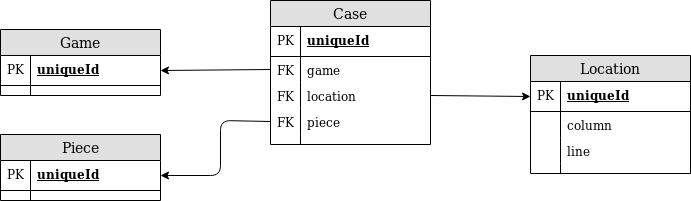

# JAVA Avancé

## Introduction

Xavier Blanc : xavier.blanc@u-bordeaux.com

LinkedIn et Youtube

GitHub

Notation :
- 1 QCM en TD de 20 min au hasard
- 1 TD sur machine 1h
- Pas de projet
- 1 Exam sur papier (Particulièrement difficile)


- [JAVA Avancé](#java-avanc%c3%a9)
  - [Introduction](#introduction)
  - [Bases (4 semaines)](#bases-4-semaines)
    - [Objet](#objet)
      - [L'objet](#lobjet)
      - [Responsabilité et encapsulation](#responsabilit%c3%a9-et-encapsulation)
      - [Couplage et Cohérence](#couplage-et-coh%c3%a9rence)
      - [Cycle de vie](#cycle-de-vie)
      - [Synthèse](#synth%c3%a8se)
    - [Classes](#classes)
      - [La classe comme moule/contrat](#la-classe-comme-moulecontrat)
      - [Visibilité et Encapsulation des données](#visibilit%c3%a9-et-encapsulation-des-donn%c3%a9es)
      - [Visibilité et Encapsulation des traitements](#visibilit%c3%a9-et-encapsulation-des-traitements)
      - [L'héritage](#lh%c3%a9ritage)
      - [Polymorphisme et surcharge](#polymorphisme-et-surcharge)
      - [Quand faut-il hériter ?](#quand-faut-il-h%c3%a9riter)
    - [Délégations, classes et interfaces](#d%c3%a9l%c3%a9gations-classes-et-interfaces)
      - [L'interface](#linterface)
    - [Test & Lint](#test--lint)
      - [Les tests (4pts à l'examen)](#les-tests-4pts-%c3%a0-lexamen)
  - [Domain Driven Design (3 semaines)](#domain-driven-design-3-semaines)
    - [Value Object (du DDD) :](#value-object-du-ddd)
    - [Entity](#entity)
    - [Aggregate](#aggregate)
    - [Tactical Pattern du Domain](#tactical-pattern-du-domain)
    - [Exemples](#exemples)
      - [Factory](#factory)
    - [Architecture hexagonale (la couche Infra)](#architecture-hexagonale-la-couche-infra)
      - [Quelle signature ?](#quelle-signature)
      - [Quel schéma ?](#quel-sch%c3%a9ma)
      - [Ou mettre le code ?](#ou-mettre-le-code)
    - [Exécution](#ex%c3%a9cution)
    - [Synthèse DDD (Ajouter des rdv, etc...)](#synth%c3%a8se-ddd-ajouter-des-rdv-etc)
  - [Architecture objet (3 semaines)](#architecture-objet-3-semaines)
  - [Avancée (2 semaines)](#avanc%c3%a9e-2-semaines)

## Bases (4 semaines)

### Objet

#### L'objet

- Identifiant
- Données
- Traitement

L'identifiant n'est pas la référence de l'objet. 
Une référence est quelque chose qui permet à un objet d'agir sur un autre objet, il se sert de l'id, mais ce dernier n'est jamais visible. 

Il peut ne pas y avoir de données dans un objet.

Java donne par défaut des traitements donc il y en a forcément 

Ce qui définie vraiment un objet, c'est qu'ils échangent des messages pour réaliser des traitements complexes.

La POO c'est découper un problème en entités contenant des données et pouvant interagir à l'aide des traitements et de l'identifiant.

Un diagramme de séquence UML résume les interactions entre objets définis par leurs identifiants

En paradigme impératif, l'objectif est de découper le problème en traitements (fonctions)

En objet on doit faire de la partition, c'est à dire qu'il est hors de question que deux objets partagent les mêmes données, et on ne partage pas les traitements non plus.

L'objectif ici est de faire une bonne conception, donc de limiter au maximum les interactions entre objets, et donc bien sûr aussi d'éviter toute redondance dans la mémoire.

```java
String s;
s = "Hello";
s = s + "Comment "
s = s + "Allez vous ?"
```
Il y a ici 3 objets de créés car à chaque addition, la machine virtuelle (jvm) créer un nouvel objet qui contient le nouveau texte

#### Responsabilité et encapsulation

> L'objet est responsable des traitements qu'il propose !

L'objet dispose donc de **tous les éléments** pour réaliser les traitements qu'il propose.

Ces éléments sont grosso modo :
 - Suite d'instruction
 - Paramètre en entrée
    - Données de l'objet ou paramètre en entrées ?
 - Résultat
 
>Exemple
>
>Une calculatrice n'a pas besoin d'avoir de données
>
>En revanche une calculatrice à mémoire devra avoir des données propre


> **Responsabilité** : 
> L'objet a tout pour réaliser ses traitements
>
> **Encapsulation** :
> Si l'objet utilise ses données pour réaliser ses traitements, il doit protéger ses données

#### Couplage et Cohérence

Les deux notions sont antagonistes !

> **Couplage** : Pour réaliser le traitement dont l'objet est responsable, il peut demander l'aide d'autre objets.

Plus on a besoin d'autres objets, plus on est couplé. Donc afin de limiter le nombre d'interactions, on tend a limiter le couplage.

La conséquence logique serait alors de partitioner tout le problème en un seul objet. On manquerait alors de cohérence !

> **Cohérence** : C'est ne pas être incohérent, et donc proposer des traitements qui n'ont pas de rapport entre eux

Concrètement, un objet est cohérent si il est insécable, dans le sens où tout ses traitements dépendent bien de toutes les données.

L'idéal de la POO est donc un faible couplage malgré une forte cohérence.

(Explication du TD)

Quand on donne un objet et qu'on l'analyse, il faut avoir un sens critique.

80% de nos intuitions sont fausses, le sens critique est donc de chercher à savoir si nos intuition sont justes ou non ?

Question d'analyse d'objet:
- L'objet possède t'il des données ?
   - Non 
        - Pas de problème d'encapsulation puisque pas de données
        - Traitement stateless
        - Toutes méthodes devraient donc être statiques (**static**) ou au pire n'être instancier qu'une fois, plus serait inutile
   - Oui
        - A t'il que des données constantes ?
            - Oui
                - Les données constantes n'ont pas à être protégées, l'objet doit donc être immutable
            - Non
                - Couplage ?
                - Cohérence ?

#### Cycle de vie

1. Création
2. Reçoit des messages & Réalise des traitements
3. Si un objet ne peut plus avoir de message, alors l'objet est détruit. C'est le cas quand un objet n'est pas référencé
 
En java les traitements sont, de bases, synchrones, on peut voir ça comme un jeton de qui a le droit de s'éxécuter.
  
Quand un objet utilise un traitement d'une autre fonction, alors il donne son jeton à cette fonction qui lui rend à la fin de son traitement. 

N'importe quel objet peut créer un autre objet (l'objet créateur a alors la référence)

#### Synthèse
Definition:
> Objet = #Id + (Data)? + Traitements

On référence des objets.

Java exception pour boolean, int, double, ... Tous les types primaires.

-----

**Responsabilité & Encapsulation**:

> **Responsabilité** : 
> L'objet a tout pour réaliser ses traitements
>
> **Encapsulation** :
> Si l'objet utilise ses données pour réaliser ses traitements, il doit protéger ses données

-----

**Couplage et Cohérence**
> **Couplage** : L'objet peut demander déléguer ses responsabilités à d'autres objets
>
> **Cohérence** : On peut pas couper l'objet en deux


### Classes

Langage Orienté Objet à Classe:

Le développeur "décrit" des classes d'objets.

Il existe deux relations entre classes et objets
- Construction: Une classe peut construire plusieurs objets, mais un objet n'auras qu'une classe constructrice. Se fait grâce au `new`
- Conformité: Un objet peut "ressembler" à plusieurs classes 

Le terme instantiation couvre les deux définitions.

Une classe est donc 
- Un moule (`new`)
- Un contrat (conformité)

Tout objet construit est conforme. La fonction patron est statique, mais la conformité peut évoluer et est plus une question dynamique.

#### La classe comme moule/contrat
- Data
    - `visibilité Type nom; // Pour la classe`
    - Conforme => L'objet possède les données définies par la classe
- Traitements
    - `visibilté TypeRetour nom(Params(Type nom)) exceptions {}`
    - Conforme => L'objet est responsable des traitements définis par la classe

```java
public class Point {
    int x;
    int y;
    public Point(int x, int y){
        this.x = x;
        this.y = y;
    }
    // getters
}
```

Conformité = Typage

**Code** = Compilation => **Code compilé** = Run => **VM**

Compilation:

- Prévenir les erreurs
- Aide votre IDE

Run:

- 2nd contrôle de de typage

2 Solutions pour avoir des entiers positifs:

- Créer sa propre classe PositiveInt
- Lever une exception à la construction

```java
class Point {
    Point (int x, int y) {
        if (x < 0) throw new TypeConstructException();
    }
}
```

#### Visibilité et Encapsulation des données

- public => Pas de verrous => Pas d'encapsulation
- private => Protégé sauf pour les objets sortis du même moule


#### Visibilité et Encapsulation des traitements

Traitements qui modifient les données :

- Normal ? => public
- Pas normal ? => private

Sur un traitement private, l'idée est qu'un autre développeur ne pourras pas utiliser le traitement.

#### L'héritage

L'héritage est une relation entre classes qui a un impact sur les objets instances des classes en relation.

Pour préciser qu'une classe hérite d'une autre, il suffit d'utiliser le mot clé `extends`.

>Principe de substitution:
>
>Si j'ai besoin d'un A, on peut me donner un B qui est conforme à A.

```java
import java.util.List;
import java.util.ArrayList;
public class Shape {
    private List<Point> pointList;
    
    public Shape() {
        pointList = new ArrayList<Point>();
    }
    
    public List<Point> getPointList(){
        return new ArrayList<Point>(pointList); 
        // Attention à ne pas directement donner pointList, qui est une référence, 
        // ce qui reviendrait donc à ruiner l'encapsulation !
    }
}

public class Rectangle extends Shape {
    public Rectangle(Point origin, int width, int height) {
        
    }
    public int getWidth() {
        
    }
    public int getHeight() {
        
    }
}
```

#### Polymorphisme et surcharge
Contrat des classes sur les objets (typage) ne porte jamais sur le code mais sur les signatures !

Le polymorphisme, c'est changer le code dans une sous classe (`@Override`), mais pas le contrat !

La surcharge, c'est changer le type, donc en gros ajouter des contraintes de typage (moins d'individus)

La covariance dit qu'on a le droit de sous typer des paramètres.

```java
public class Transformer <T extends Shape> {
    T transform(T in) {
        return in;
    }
}
```
#### Quand faut-il hériter ?
Héritage pourrait être une bonne solution si:
1. Vous êtes en train de dupliquer du code dans 2 classes ?  
2. Si vous voulez réutiliser des traitements en les adaptant
3. Le plus intéressant, vous êtes en train de définir un contrat qui **DEVRA** être complété par un autre développeur. => Classe abstraite
### Délégations, classes et interfaces
Peut on réaliser le cas 2. sans héritage ?


Oui grâce à la délégation, c'est à dire que l'on peut utiliser les méthodes d'un attribut.


Exemple:
```java
public class A {
    public void f() {
        System.out.println(1);
    }
}

public class B extends A {  // Héritage
    public void g() {
        f();
    }
}

public class C {  // Délégations
    private A a;
    public void g() {
        a.f();
    }
}
```

- Héritage
    - Avantages :
        - Moins d'objets
        - Moins d'appel de méthode
        - *"Moins de dépendances directes"*
        - Substituabilité
    - Inconvénients :
        - .
- Délégation
    - Avantages :
        - .
    - Inconvénients :
        - Plus d'objets
        - Plus d'appels de méthode
        - *"Plus de dépendances directes"*
        - Pas de substituabilité

#### L'interface

> Interface : Définition d'un ensemble "cohérent" de méthodes (signature)
>
>  Pas de code (Sauf dans java récent => Code par défaut)

On dissocie la définition du code (signature) de la façon dont elles sont implémentées (code)

```java
public interface BItf {
    void f(); // J'ai besoin de f(), peut importe la façon dont c'est codé
}
```

J'ai B qui réalise f() {}
```java
public class B implements BItf {
    public void f() {
        // code
    }
}

public class BHeritage extends B {
    public void f() {
        super.f(); // J'utilise le code de B
    }
}

public class BDelegation {
    private B b;
    public void f() {
        b.f();
    }
}

public class Main {
    public static void main(String[] args){
      BHeritage bh = new BHeritage();
      BDelegation bd = new BDelegation();
      bh.f();  // dépends du code de B
      bd.f();  // dépends pas du code b
    }
}
```

- Héritage
    - Avantages :
        - Moins d'objets
        - Moins d'appel de méthode
        - *"Moins de dépendances directes"*
        - Substituabilité
    - Inconvénients :
        - .
- Délégation
    - Avantages :
        - **On ne dépend pas du code de réalisation grâce à l'interface**
    - Inconvénients :
        - Plus d'objets
        - Plus d'appels de méthode
        - *"Plus de dépendances directes"*
        - Pas de substituabilité
        
```java
public  class Point {
    private int x;
    private int y;
    
    public int getX() {
    return x;
    }
    
    public int getY() {
    return y;
    }
}

// Rectangle => new Point();
// Carre => new Point();
// Droite => new Point();
// Pas top

public interface PointFactoryItf {
    public Point createPoint(int x, int y);
}

public class PointFactoryImpl implements PointFactoryItf {
    public Point createPoint(int x, int y) {
        return new Point();
    }
}
```
 
```java
public class BenchMarkTri extends Tri {
    public int bench() {
        int time = 0;
        for (int n = 0; n < N; n++) {
            int start = Time.time();
            tri();
            int stop = Time.time();
            time += stop - start;            
        }
        return time / N;
    }
}

// ==============================

public interface SortAlgo {
    public String[] sort(String[] in);
}

public class BenchMark {
    private SortAlgo sa;
    public void setSortAlgo(SortAlgo sa) {
        this.sa = sa; 
    }
    
    public int bench() {
        int time = 0;
        for (int n = 0; n < N; n++) {
            int start = Time.time();
            sa.sort();
            int stop = Time.time();
            time += stop - start;            
        }
        return time / N;
    }
}
```

```java
// Héritage
public class PNJ extends PlayerFinder {
    public void findAndKill() {
        findPlayer();
        // ...
        
    }
    
    public void findAndRun() {
        findPlayer();
        // ...
    }
}

// Délégation
public interface PlayerFinderItf {
    Player findPlayer;
}

public class PlayerFinderA implements PlayerFinderItf {
    Player findPlayer() {
        // ...
    }
}

// Niveau j'ai pas compris, y a pas d'intérets

public class PNJ {
    private PlayerFinderItf playerFinder = new PlayerFinderA(); // @ compile time
}

// Niveau OK mais pas très souple

public  class PNJ {
    private PlayerFinderItf playerFinder;
    public PNJ(PlayerFinderItf playerFinder) {
        this.playerFinder = playerFinder; // @ runtime instantiate
    }
}

// Niveau souplesse 

public  class PNJ {
    private PlayerFinderItf playerFinder;
    public void setPlayerFinder (PlayerFinderItf playerFinder) {
        this.playerFinder = playerFinder; // @ runtime whenever i want
    }
}

```

A lire :
- Design Patterns:
    - Gang of Four (GOF)
    - Explication de l'intérêt de la délégation
    - Golden Rule:
        - Reuse dynamics VS Perf.
        

      
### Test & Lint

#### Les tests (4pts à l'examen)
Un bon tester est un tester qui cherche ce qui ne marche pas.

Donc il faut avoir une définition de "ça marche" (Oracle = Résultat attendu) et montrer l'inverse !

Quand a-t-on terminé de tester ?

Dans l'absolu, jamais ! Mais dans la pratique, on va essayer de définir le paramètre des tests et on va le partitioner en classes d'équivalences.
Après je fais un test par partition et on considère l'ensemble couvert.


Pour tester:
1. Avoir l'oracle
2. Définir votre partition
3. 1 test / partition

Exemple : 

Tester `String[] sort(String[])`
```java
class Test {

    // Oracle
    boolean oracleSort(String[] sorted) {
        for(int i = 0; i < sorted.length - 1; i++) {
            if (sorted[i] >= sorted[i+1]) {
                return false;
            }
        }
        return true;
    }
    
    // Partition = Quelques points, mais là il y a surtout un tableau aléatoire de mots
}


```

## Domain Driven Design (3 semaines)

Le principe fondamental: le code fait autorité !

Il y a 3 endroits où la vérité peut se trouver:

- Cahier des charges : besoins exprimés par le propriétaire
- Spécifications du futur/présent logiciel (UML)
- Code
- Data

Selon le DDD, la vérité se trouve dans le code, et plus spécifiquement dans la couche domain.

Exemple: Application de gestion de compétition

- Joueur (Nom, Prénom) *Immutable*
- Match (Début, Fin, ajouter points, Gagnant)
- Compétition (Ouverte aux inscriptions, plusieurs joueurs, elle démarre, on peut jouer des matchs, on a le grand gagnant)

```java
import java.util.regex.Pattern;
import java.util.regex.Matcher;
public class Joueur {
    public final ChaineAlphabetique nom;
    public final ChaineAlphabetique prenom;
}


public class ChaineAlphabetique {
    private final static Pattern pattern = Pattern.compile("[a-zA-Z -]*");
    private static Matcher matcher;
    private final String valeur;
    
    public ChaineAlphabetique(String valeur) {
        matcher = pattern.matcher(valeur);
        if (matcher.find()) {
            this.valeur = valeur;
        } else {
            throw RuntimeException;
        }
    }
    
    @Override public boolean equals(Object autre) {
        if (!autre instanceof ChaineAlphabetique) {
            return false;
        }
        ChaineAlphabetique autreChaine = (ChaineAlphabetique) autre; 
    return valeur.equals(autreChaine.valeur);
    }}
```

### Value Object (du DDD) :

objet défini par la valeur de ses propriétés (=> Immutable)

(Bob, L'éponge) != (Bob, The Sponge).

Il est important pour un value object de redéfinir equals.

```java
import java.util.regex.Pattern;
import java.util.regex.Matcher;
public class Joueur {
    public final ChaineAlphabetique nom;
    public final ChaineAlphabetique prenom;
    
    @Override public boolean equals(Object autre) {
        if (!autre instanceof Joueur) {
            return false;
        }
        Joueur autreJoueur = (Joueur) autre;
        return nom.equals(autreJoueur.nom) && prenom.equals(autreJoueur.prenom);
    }
}
```

Avec un Value Object, il est aussi très intéressant de créer une factory puisque les instances sont immutables

Ici le match peut changer d'états, donc il n'est pas immutable, donc ce n'est pas un value object;

### Entity

```java
public class Match { // Entity
    private final ID id;
    private Joueur j1, j2;
    private EtatDuMatch etatMatch;
    private Score nbPointJ1, nbPointJ2;
    private Date debut, fin;
    
    public void joueur1Marque(Score points) {
        nbPointJ1.incremente(points);
    }
    
    public void joueur2Marque(Score points) {
        nbPointJ2.incremente(points);
    }
}
```

L'entity n'est donc pas immutable, elle nécessite un identifiant

### Aggregate

L'aggregate est l'objet qui donne du sens à un ensemble d'entity.

```java
import java.util.Set;
public class Competition { // Aggregate
    Set<Joueur> joueurs;
    Set<Match> matches;
    
    public void inscrireJoueur(Joueur j){
        if (joueurs.contains(j)) {
            throw new RuntimeException("Le joueur est déjà inscrit");
        }
        joueurs.add(j);
    }
    
    public void fermerInscription(){
        // créer les différents matchs à partir de l'ensemble des joueurs
    }
}
```

La root de l'aggregate est la porte d'accès qui permet de manipuler l'ensemble des entités, et ce à partir de l'instance.

Il est interdit à un aggregate de rendre une entity comme ça, il faut impérativement créer une méthode qui englobe et contrôle à l'aide de paramètres.

Si on veut faire évoluer le CdC, par exemple en ajoutant les statistiques aux joueurs, on change le contexte (le joueur n'est plus immutable).

De façon général à chaque nouveau contexte il faut donc recoder l'ensemble de l'application.

### Tactical Pattern du Domain

- Value Object => Immutable et equals by values
  - Typage plus fort que Java
  - Pas de soucis avec l'encapsulation
- Entity => State et equals by id
  - L'objet classique mais attention à bien définir l'id
- Aggregate => Groupe, Racine ATTENTION Encapsulation des Entity
  - Gestion des entity (Aide à la save)

### Exemples

- Echiquier
  - Colonnes identifiées par des lettres de A à H
  - Lignes identifiées par des chiffres de 1 à 8
  - Location serait un value object car immutable (A,1) 

```java
public class Location {
    public final char column;
    public final int line;
    public Location(char column, int line) {
        if (line < 1 || line > 8) {
            throw new IllegalParameter("Line should be between 1 and 8")
        }
        if (column < 'A' || column > 'H') {
            throw new IllegalParameter("Column should be between A and H")
        }
        this.line = line;
        this.column = column;
    }
}
```

En aggregate => Game

```java
public class Game {
    public Game() {
        //
    }
    public void move(Location from, Location to) {
        //
    }
}
```

- Piece
  - Couleur
    - Immutable
  - Position
    - Mutable
  - Importance
    - Dépend de l'implémentation
  - Vivante | Morte
    - Mutable
  - Mouvement
    - Dépend de l'implémentation

==>

Value objects:

- Color
  - Enum

```java
public class Piece {
    private Location location;
    public abstract void move(Location newLoc) {
        //
    }
}
```

Sauf que d'après Applying UML et son pattern GASP, une méthode va dans la classe qui possède ou peut obtenir toutes infos pour executer la méthode.

Ici ça serait donc Aggregate qui devrait donc être responsable du mouvement. La localisation devrait donc se trouver également dans le aggregate.

```java
public abstract class Piece {
    private Color;
    public boolean isLegalMove(Location from, Location to) {
        if (from.equals(to)) {
            return false;
        }
    }
}
```

```java
public class King extends Piece {
    public boolean isLegalMove(Location from, Location to) {
        super.isLegalMove(from, to)
        if (Math.abs(from.x - to.x) > 1 || Math.abs(from.y - to.y) > 1) {
            return false;
        } else {
            return true;
        }
    }
}
```

Au choix dans le game pour avoir les coordonnées, on peut:

- `Map<Location, Piece>`
- `Map<Piece, Location>`
- `List<Case>`
  
On va choisir la troisième:

```java
public class Case {
    Piece p;
    Location l; // Il ne peut y avoir 2 cases avec la même location (id)
}
public class Game {
    private List<Case> cases;

    public void move(Location from, Location to) {
        Case case = getCaseFromLocation(from);
        Piece pieceFrom = case.getPiece();
        boolean isLegal = pieceFrom.isLegalMove(from, to);

    }

    private Case getCaseFromLocation(Location location) {
        for (Case case: cases) {
            if (location = case.getLocation()) {
                return case;
            }
        }
    }

    private List<Location> getIntermediaryLocation(Location from, Location to) {
        //
    }

}
```

Afin de deséppaissir la classe Game, on peut sortir des méthodes stateless de Game vers une classe dite Service. Service serait alors un regrouppement de méthodes statiques prenant comme argument des value object (pas d'entity). Il est recommandé de faire une classe stateless par méthode service.

DDD Tactiques en pratique:

1. Value Objects
2. Aggregate -> Méthode métier (params VO)
3. Structuration aggregate => Entity
4. Création des services

#### Factory

Game

- Ajout de méthodes utiles
  - Location intermédiaires
  - Mouvements possibles
  - etc
- Améliorer la cohérence, peut être au dépend du couplage, en créant des services

```java
public class Game {
    public Game() {
        // Générer la liste des cases
        // Y placer les pièces
        // Environ 100 objets à créer
    }
}
```

Quand le new est compliqué comme ci-dessus, et qu'il nécessite trop de sous abstractions, on le sort dans une classe dite Factory. On va donc y soigner le code de construction en construisant toutes les sous méthodes qui décomposent la création (sous niveau d'abstraction). 

Problème : Comment la factory accède aux attributs pour construire l'aggregate (Le mieux: friendly, en java: héritage).

On peut également vouloir faire des factory pour limiter le nombre d'instance de VO

### Architecture hexagonale (la couche Infra)

Rappels: La couche domaine

- Le typage (Value objects)
- Les règles métiers (Entity, Aggregate)

Il faut donc un package domain.

- Pas d'IHM
- Pas de sauvegarde
- Pas d'autre chose
- **Aucune dépendance**
  - Ca compile donc tout le temps
  - Si on a un framework, alors le couche domain doit être indépendante du framework
  - Ca compile même avec les vieilles version de java pour que ça fonctionne partout

Comment alors faire des sauvegardes:

- Avant / Sans approche DDD:
  - On part d'un schéma des données (SQL, Mongo, etc...)
  - On utilise un framework pour générer des classes qui font le pont vers la VM
  - On créer nos classes personelles et on hérite des classes générées.
  - Exemple:
    1. Game.sql
    2. GameHibernate.java
    3. Game extends GameHibernate
    - La fonction save de Game provient alors de ce qui a été généré par Hibernate, celle ci contient alors tous les appels à la base SQL
  - Questions:
    - Ou mettre le code de sauvegarde ?
    - Quel schéma ?
    - Quelle signature de sauvegarde ?
    - Autorité / Autonomie ?

Exemple avec Game:

#### Quelle signature ?

> void save dans Game / void save dans une classe GameSaver

> Game load(id) dans Game/ Game load(id) dans GameSaver

`findGameById()` = `load()`

`findGameByManyMoves(int nb_moves)`

`update()`

- Après approche DDD:
  - L'interface / classe abstraite Repository (Gestionnaire de sauvegarde)
    - Uniquement pour les aggregate

```java
package domain;

public interface GameRepository {
    void save(Game game);
    Game load(int gameID);
    Game findByETC(...);
    void update(Game game);
}
```

- Cette interface doit être mise dans la couche domain puisque cela fait parti de la conception.
- L'implémentation en revanche doit être dans la couche infrastructure

#### Quel schéma ?

> Comment je sauvegarde mon Aggregate ?

- Quel format ?
  - SQL ?
  - CSV ?
  - JSON ?
- On va partir sur SQL:


#### Ou mettre le code ?

```java
package infra;

import java.sql.*;

public class GameSQLRepository implements GameRepository{
    public void save(Game game) {
        String url = "jdbc:msql://200.210.220.1:1114/Demo";
        Connection conn = DriverManager.getConnection(url,"","");
        Statement st = conn.createStatement();
        st.executeUpdate("INSERT INTO Game " +
            "VALUES (" + game.id + ")");

        conn.close();
    }
}
```

### Exécution

1. Qui/Où/Comment appele le repository ?
2. Comment échanger la référence du repository ?
   1. (Dans le aggregate)
   2. Dans les services à l'extérieur

```java
package domain;

public class Game {
    GameRepository rep;
    public void setRepository(GameRepository rep) {
        this.rep = rep;
    }

    public void move(Location from, Location to) {
        // ...
        rep.save()
    }
}
```

Le main ne peut pas être dans le domain puisque c'est lui qui défini les implémentations => En général on le met en dehors de toutes les couches.

```java
import domain.*;
import infra.GameSQLRepository;

public class Main {
    public static void main(String[] args) {
        GameRepository rep = new GameSQLRepository();
        Game game = new Game();
        game.setRepository(rep);
    }
}
```

Dans le DDD il y a donc inversion de la dépendance : c'est bien la sauvegarde qui dépend de la couche domain et pas l'inverse.

Un autre intérêt est que l'on peut facilement créer et intervertir différentes implémentations, par exmple une en mémoire JVM pour pouvoir tester facilement.

### Synthèse DDD (Ajouter des rdv, etc...)

Exemple: l'Agenda (Ajouter des rdv, etc)

| Concepts métiers |       DDD        | Techno (Abstrait) |
| ---------------- | :--------------: | ----------------- |
| Agenda(2)        | (1) Value Object |                   |
| Rendez-vous(3)   |  (2) Aggregate   |                   |
| Date(1)          |    (3) Entity    |                   |
| Sujet(1)         |   (4) Factory    |                   |
| Lieu(1)          |  (5) Repository  |                   |
|                  |   (6) Service    |                   |

```java
public class Date { // Value Object
    private int mois;
    private int jour;

    public Date(int mois, int jour) {
        this.mois = mois;
        this.jour = jour;
    }

    public boolean equals(Object o) {
        if (this == o) return true;
        if (!(o instanceof Date)) return false;
        Date date = (Date) o;
        return mois == date.mois &&
               jour == date.jour;
    }

    public int hashCode() {
        return Objects.hash(mois, jour);
    }
}
```

```java
public class Agenda { // Agregate
    private int id;
    private int genId = 0;
    private Set<RdV> rdvSet;

    public int ajouterRdV(Date debut, Date fin, Sujet sujet, Lieu lieu) {
        RdV rdv = new RdV(genId++, ...)
        return id;
    }

    public void modifierSujetRdV(Sujet sujet, int idRdV) {

    }

    public int trouverRdVParDebut(Date date) {

    }

    public List<Map<String, String>> getRdVsDAO() {
        List<Map<String, String>> daos = new ArrayList<>();
        for (RdV rdv: rdvSet) {
            daos.add(new HashMap<>) ...
        }
        return new ArrayList<Map<String, String>>()
    }
}
```

```java
public class RdV { // Entity
    private int id;
    private Sujet sujet;
    private Lieu lieu;
    private Date debut;
    private Date fin;

    public RdV(int id, Sujet sujet, Lieu lieu, Date debut, Date fin) {
        this.id = id;
        ...
    }

    public boolean equals(Object o) {
        if (this == o) return true;
        if (!(o instanceof RdV)) return false;
        RdV rdv = (RdV) o;
        return id == rdv.id;
    }

    public int hashCode() {
        return Objects.hash(id);
    }
}
```

> Services
>
> Métode métier sans état qu'on ne peut ranger dans Agg, Ent, VO ...

Exemple: Trouver une date libre communne à plusieurs agendas à partir d'une certaine date et pour une certaine durée

```java
package domain;

public class AgendaService {
    Date creneauLibreCommun(Set<Agenda> agendas, Date debut, int duree) {
        ...
    }
}
```

> Repository / Factory
>
> Le premier fais les sauvegardes et les chargement, le deuxième la construction
>
> Les deux concernent plutôt l'aggregate

```java
package domain;

public interface AgendaRepository {
    void save(Agenda agenda);
    Agenda load();
}
```

Data Access Object

```java
package infra;

public class AgendaFileRepository {
    void save(Agenda agenda) {
        // Save in a file
    }
}

```

## Architecture objet (3 semaines)

## Avancée (2 semaines)
