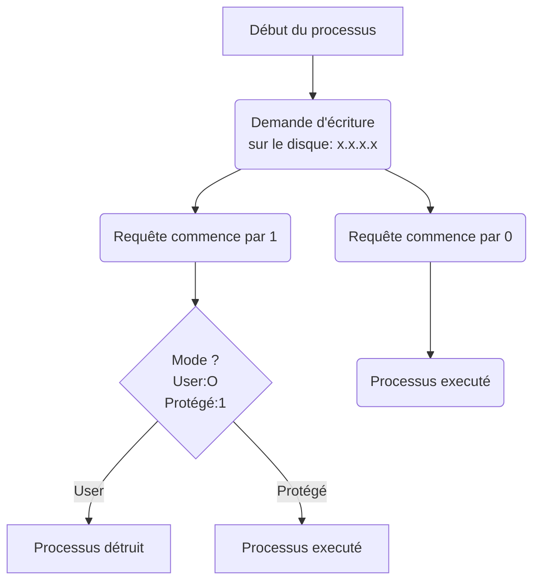

# Algorithmique, Programmation et Utilisation des Systèmes Informatiques


  - [Ordinateur](#ordinateur)
    - [Composants basiques:](#composants-basiques)
      - [Le contenu de la RAM:](#le-contenu-de-la-ram)
    - [Le processeur](#le-processeur)
  - [Les processus](#les-processus)
    - [Jeux d'instructions du processeur](#jeux-dinstructions-du-processeur)
    - [Etats des Processus:](#etats-des-processus)
    - [Filiation des processus](#filiation-des-processus)
    - [Les librairies de langages](#les-librairies-de-langages)
  - [Environnements UNIX](#environnements-unix)
    - [Propriétaire et groupe (unix)](#proprietaire-et-groupe-unix)
    - [Comment tuer un processus](#comment-tuer-un-processus)
    - [Système de Fichiers](#systeme-de-fichiers)
      - [Physique](#physique)
      - [Logique](#logique)
    - [Désignation des fichiers et répertoire](#designation-des-fichiers-et-repertoire)


## Ordinateur

### Composants basiques:

- **Microprocesseur**

- **RAM**: Random Access Memory.
  - Accessible en lecture et écriture.
  - Encore appelé Mémoire vive.

- **Type de périphériques**:
  - D'entrée: clavier, scanner, HDD (Hard Drive Disk -> dique dur)...
  - De sortie: écran, imprimante, HDD...

- **Horloge**.


Le temps est "discret". Il n'est pas continue, mais s'execute à des temps défini. Une Horloge marque le "pas" du temps.

***Règle***:  A un instant donné, le processeur *(considéré comme monocore - avec une seule unité)* ne peut effectuer qu'une seule opération élémentaire: lire une case mémoire sur la RAM, écrire sur la RAM, executer une instruction élementaire...).

####Le contenu de la RAM:

L'information est stocké sous forme binaire. La taille de la case mémoire est généralement de 64 bits qui contiennent des data ou des instructions.


### Le processeur

Le processeur contient l'**UAL** : Unité Arithmétique et Logique.


*L'intérêt du schéma ici c'est juste A B et Y... A et B les deux chiffres et Y le résultat.*

A est appelé R1 par le prof, B est R2, Y est R3. L'UAL lit les cases A et B et affiche le résultat sur Y (instruction: save R3 sur la RAM).

Pour additionner deux réels, on a 6 "top horloges":

- lire R1
- lire R2
- calculer R3
- save R3
- afficher R3
- ?

Les **FLOPS** sont *les nombres d'opérations en virgule flottante par seconde.*

Il faut une puissance de calcul de 1 GFLOPS (lire gigaFLOPS) avec un processeur de 6GHz.

**Temps d'accès moyen à une case mémoire:**

- sur la RAM: quelques nano-secondes
- sur un SSD: quelques microsecondes
- sur un DD: quelques millisecondes


## Les processus

Un processus est une **"occurence"** en mémoire d'un programme éxecutable.

Le noyau du système gère le stockage mémoire de la RAM. Cela garantie l'intégrité de fonctionnement de l'ordinateur et protège le matériel présent qui a des ressource **critique**.

Le code du noyau se trouve sur le DD et il est chargé dans la RAM au **boot** de l'ordinateur.
Le processur attribue un identifiant unique à chaque processus, le **PID**. C'est un nombre entier (exemple: PID = 8112). Le noyau lui n'a **pas**  de PID.


*Exemple de représentation d'un processus:*

**Calculatrice**

​	| CODE

​	|

​	PID


L'horloge relié au microprocesseur envoie une décharge électrique au bout de $\Delta$t(s) qui va retirer/geler le processus en cours et charger le noyau. Ce $\Delta$t est appelé le **quantium** de temps. Ceci permet d'éviter qu'un processus utilise indéfiniment le processeur ne permettant pas aux autres processus de fonctionner.


Ou Schéma trouvé sur internet....


Si le noyau n'a pas finit de traiter les demandes des différents processus (appelés **"appels systèmes"**), il est quand même déchargé et rechargé ensuite par l'horloge. $\Delta$t est en général de l'ordre de quelques millisecondes donnant une impression de fluidité (cache les gelages des différents processus).

**CPU**: Controll Process Unit.

Un processus peut "s'auto-geler" s'il n'a plus rien à faire pendant $\Delta$t, il fait un *appel système*. Avant l'ordonnancement (le choix du prochain processus à éxecuter) le noyau execute les Appels Système.


### Jeux d'instructions du processeur

Les **instructions critiques** du processeur accèdent au matériel (par exemple: écriture sur le disque dur) et les **non critiques** ne peuvent pas y accéder. Pour protéger le matériel de demandes illégitimes de processus (malveillants notemment), ils ont rajoutés dans le processeur une case mémoire de 1 bit (0 ou 1) appelé le **mode**.

En effet seul le noyau doit executer les appels systèmes et peut demander aux processeur d'écrire sur le disque par exemple. Si on ne met pas en classe cette sécurité supplémentaire, des programmes pourrait copier un bout du code du noyau et executer des appels systèmes à la place de ce dernier.

Quand la case mémoire est sur 0: ***mode user***

Quand la case mémoire est sur 1: ***mode protégé***

Exemple (les nombres et les instructions sont arbitraires)



En fait, si l'instruction est critique (ici commence par **1**), il faut absolument que le mode du processeur corresponde et soit sur 1 aussi sinon le processus est détruit. Dans tous les autres cas le processus est executé. Dans le graph avec les processus plus haut, c'est au moment où l'horloge envoie ces courants électriques que le basculement du mode se fait. Lorsque ce sont les processus courrants qui sont sur le processeur le mode est **0**, lorsque le noyau passe sur le processeur, l'horloge bascule le mode sur **1**. Ainsi seul le noyau peut executer les instructions critiques (incluant les appels systèmes).

***Comment le processeur sait où trouver le code du noyau dans la RAM puisque le noyau n'a pas de PID ?***

Le noyau n'a pas de PID mais étant chargé en premier lors du démarrage de l'ordinateur il se trouve "tout en bas" de la RAM au début. Donc le processeur a chaque fois qu'il doit aller chercher le noyau dans la RAM il va "chercher" dans l'adresse électronique la plus basse (imaginer la RAM comme un immeuble, le noyau est au rez de chaussée).

Pour que le noyau soit chargé en premier lors du démarage de l'ordinateur il y a un composant à coté du processeur qui contient un peu de mémoire la **ROM** qui contient le **BIOS**, un petit utitilitaire qui permet de choisir le système d'exploitation ( et le noyau ) en cherchant dans le disque dur si il y a un noyau.


### Etats des Processus:

- En création (en cours de copie sur la RAM et attribution de PID)
- En attente
- En execution
- STOP
- Terminaison (détruit)

La politique d'ordonnancement donne à chaque processus un niveau de priorité (nombre entier).

Plus la valeur est élevé plus le processus est prioritaire. Une fois le processus executé, il voit sa priorité diminuée. La priorité de tous les processus en attente est alors augmenté.


### Filiation des processus

***Un processus n'est créé qu'à l'initiative d'un autre processus (il y a une exception) en passant par le noyau par un appel système.***

On identifie ainsi le Parent PID (**PPID**) qui est le PID du processus initiateur.

Le noyau crée le tout premier processus au démarage de l'ordinateur (init), qui lui même crée d'autre processus et ainsi de suite. Si le processus meurt les fils peuvent mourir ou continuer à exister en fonction de ce que prévoit le programmeur. Si un processus devient orphelin sont PPID correspond à celui de *init* (1). Et si *init* meurt ça crash.


### Les librairies de langages

Ils en existent des nombreuses (python, C, java, etc...) qui ont des fonctions pré-conçus et qui évitent d'avoir à tout recoder. Exemple: la fonction cosinus: cos(x).


## Environnements UNIX

Nom du Noyau: **Linux**

Nom de la Communauté ayant le plus contribué à Linux: **GNU**

Nom complet du système: **GNU / Linux**

La Free Software Foundation, porté par *Richard Stallman* fonde GNU


### Propriétaire et groupe (unix)

Chaque processus à un **propriétaire**.

Exemple: Root - *Login de l'administrateur système*

Les propriétaires peuvent êtres recensés en **sous-groupes**. Un propriétaire / utilisateur (c'est pareil) peut appartenir à plusieurs groupes mais appartient au moins à un. Mais à un instant t, le propriétaire est dans un seul groupe.


**Processus**

​	| CODE

​	|

​	PID

​	PPID

​	Propriétaire

​	Groupe


### Comment tuer un processus

Il y a deux moyens:

- un diplomatique: envoyer un signal  TERM (valeur: 9) via la commande :

  ```php
  kill -9 PID
  ```

  ​


- un non-diplomatique: envoyer un signal KILL (valeur 15) instantané via la commande:

  ```php
  kill -15 PID
  ```


La condition à l'envoie de ces requêtes est que le processus qui envoie la requête ait le même propriétaire que le processus a tuer sauf si c'est *root* qui est le super-utilisateur.


### Système de Fichiers

#### Physique

Sur un DD on peut partitionner le disque. Le système croit que "physiquement", il y a deux disques. Une fois qu'il est partitionné, il faut le formater. On a comme type de format célèbre:

- **FAT32** (premières versions DOS)
- **exFAT**
- **NTFS** (windows)
- **ext-2 -3 -4** (linux)
- **btrfs** (ORACLE - se développe)
- **zfs** (dans le futur très performant)

#### Logique

On parle de Dossier (windows) et Répertoire (linux).

Unix:

 -   **/** RACINE
   - **bin**: binaries - executables
   - **sbin**: super binaries (root)
   - **tmp**: temporary
   - **dev**: devices
   - **media**: lecture abstraite des devices
   - **home**: comptes des utilisateurs, contient les espaces de travails ( ***HOME_DIR*** )

Il est recommandé de ne pas utiliser d'espace dans les noms des fichiers et faire attention à la **casse**.


### Désignation des fichiers et répertoire

**Notation absolue**:	***/ home / login 2 / unix / d1 / fichier1.txt***

**Notation relative**:	***. / .. / .. / login 1 / d1 / fichier1.txt***

Processus placé dans le répertoire courant (**CUR_DIR**)

**..**	répertoire parent

.	répertoire courant

~	chemin absolu vers ***HOME_DIR***
